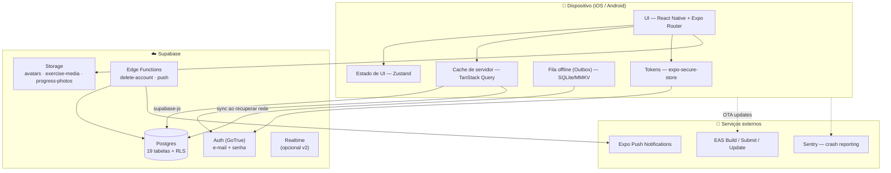

# 01 — Arquitetura Técnica

[← Voltar ao índice](./README.md)

---

## 1. Visão macro



**Princípio central:** o app fala **direto com o Supabase** (sem backend intermediário). A segurança é
garantida por **Row Level Security no Postgres** — não por lógica no cliente. Lógica que não pode
rodar no cliente (exclusão de conta, envio de push) vai para **Edge Functions**.

---

## 2. Stack escolhida

### 2.1 Núcleo

| Camada | Escolha | Por quê |
|---|---|---|
| Framework | **Expo (SDK atual)** com React Native | Build gerenciado, EAS, OTA updates, config plugins |
| Linguagem | **TypeScript** (`strict: true`) | Tipos gerados do banco = menos bug em runtime |
| Navegação | **Expo Router** (file-based) | Deep linking automático, layouts aninhados, padrão da Expo |
| Backend | **Supabase** | Postgres + Auth + Storage + RLS num pacote só |
| Build/Deploy | **EAS Build + EAS Submit + EAS Update** | Pipeline oficial, assina e envia para as duas lojas |

> ⚠️ **Não usar Expo Go.** O projeto usa bibliotecas com código nativo (MMKV, Reanimated, notificações,
> Skia). Usar **development build** desde a Fase 0: `npx expo run:ios` / `npx expo run:android`
> ou `eas build --profile development`.

### 2.2 Estado e dados

| Necessidade | Biblioteca | Papel |
|---|---|---|
| Estado do servidor | `@tanstack/react-query` v5 | Cache, revalidação, retry, persistência offline |
| Persistência do cache | `@tanstack/query-async-storage-persister` + `react-native-mmkv` | Cache sobrevive ao fechar o app |
| Estado de UI/sessão ativa | `zustand` | Estado do player de treino (cronômetro, série atual) |
| Formulários | `react-hook-form` + `zod` + `@hookform/resolvers` | Validação declarativa, mesma schema no client e nos tipos |
| Cliente do banco | `@supabase/supabase-js` v2 | SDK oficial |
| Tipos do banco | `supabase gen types typescript` | Tipos gerados automaticamente do schema |

### 2.3 Interface

| Necessidade | Biblioteca |
|---|---|
| Estilos | **NativeWind v4** (Tailwind para RN) + tokens próprios |
| Animações | `react-native-reanimated` v3 |
| Gestos / drag-and-drop | `react-native-gesture-handler` + `react-native-draggable-flatlist` |
| Listas grandes | `@shopify/flash-list` |
| Bottom sheets | `@gorhom/bottom-sheet` |
| Ícones | `lucide-react-native` |
| Gráficos | `victory-native` (XL) + `@shopify/react-native-skia` |
| Imagens | `expo-image` (cache e placeholder nativos) |
| Vídeo | `expo-video` |
| Safe area | `react-native-safe-area-context` |
| Skeleton / loading | `react-native-reanimated` (shimmer próprio) |

### 2.4 Recursos de dispositivo

| Recurso | Biblioteca |
|---|---|
| Armazenamento seguro (tokens) | `expo-secure-store` |
| Armazenamento rápido (cache/outbox) | `react-native-mmkv` |
| Banco local (fila offline) | `expo-sqlite` |
| Notificações push e locais | `expo-notifications` |
| Haptics (feedback ao concluir série) | `expo-haptics` |
| Câmera / galeria (foto de progresso, avatar) | `expo-image-picker` |
| Manter tela ligada durante o treino | `expo-keep-awake` |
| Áudio do timer de descanso | `expo-audio` |
| Detecção de rede | `@react-native-community/netinfo` |
| Localização/idioma | `expo-localization` + `i18next` + `react-i18next` |
| Splash / ícone | `expo-splash-screen` |

### 2.5 Qualidade

| Necessidade | Ferramenta |
|---|---|
| Lint | ESLint (`eslint-config-expo`) + `eslint-plugin-import` |
| Format | Prettier + `prettier-plugin-tailwindcss` |
| Git hooks | Husky + lint-staged |
| Commits | Commitlint (Conventional Commits) |
| Testes unitários | Jest + `jest-expo` + `@testing-library/react-native` |
| Testes E2E | Maestro (mais simples que Detox para Expo) |
| Crash / erros | `@sentry/react-native` |
| Analytics | PostHog ou Firebase Analytics (decidir na Fase 6) |

---

## 3. Estrutura de pastas

```
Aplicativo Mobile/
├── app/                              # ROTAS (Expo Router) — só telas, sem lógica pesada
│   ├── _layout.tsx                   # Root: providers (Query, Auth, Theme, SafeArea, Gestures)
│   ├── index.tsx                     # Redirecionador (splash → auth ou app)
│   ├── +not-found.tsx
│   ├── (auth)/                       # Grupo não autenticado
│   │   ├── _layout.tsx               # Guard: redireciona se já logado
│   │   ├── welcome.tsx
│   │   ├── sign-in.tsx
│   │   ├── sign-up.tsx
│   │   ├── forgot-password.tsx
│   │   ├── reset-password.tsx
│   │   └── verify-email.tsx
│   ├── (onboarding)/
│   │   ├── _layout.tsx
│   │   ├── profile.tsx               # nome, nascimento, sexo
│   │   ├── body.tsx                  # altura, peso
│   │   ├── goal.tsx                  # objetivo + nível
│   │   └── frequency.tsx             # dias/semana + lembretes
│   ├── (app)/                        # Grupo autenticado
│   │   ├── _layout.tsx               # Guard: exige sessão + onboarding completo
│   │   ├── (tabs)/
│   │   │   ├── _layout.tsx           # Tab bar
│   │   │   ├── index.tsx             # 🏠 Início (dashboard)
│   │   │   ├── workouts.tsx          # 🏋️ Treinos
│   │   │   ├── progress.tsx          # 📈 Progresso
│   │   │   └── profile.tsx           # 👤 Perfil
│   │   ├── plan/
│   │   │   ├── [id].tsx              # Detalhe da rotina
│   │   │   ├── new.tsx
│   │   │   └── [id]/edit.tsx
│   │   ├── day/
│   │   │   ├── [id].tsx              # Detalhe da ficha
│   │   │   └── [id]/edit.tsx
│   │   ├── session/
│   │   │   ├── active.tsx            # ▶️ PLAYER DE TREINO
│   │   │   ├── summary/[id].tsx      # Resumo pós-treino
│   │   │   └── [id].tsx              # Detalhe de sessão passada
│   │   ├── exercise/
│   │   │   ├── library.tsx
│   │   │   ├── [id].tsx
│   │   │   └── new.tsx
│   │   ├── body/
│   │   │   ├── measurements.tsx
│   │   │   ├── new-measurement.tsx
│   │   │   └── photos.tsx
│   │   ├── goals/
│   │   │   ├── index.tsx
│   │   │   └── new.tsx
│   │   └── settings/
│   │       ├── index.tsx
│   │       ├── account.tsx
│   │       ├── notifications.tsx
│   │       ├── appearance.tsx
│   │       ├── units.tsx
│   │       ├── privacy.tsx
│   │       └── delete-account.tsx
│   └── (modals)/
│       ├── exercise-picker.tsx
│       ├── rest-timer.tsx
│       └── set-editor.tsx
│
├── src/
│   ├── components/
│   │   ├── ui/                       # Primitivos do design system
│   │   │   ├── Button.tsx  Input.tsx  Card.tsx  Sheet.tsx
│   │   │   ├── Badge.tsx   Avatar.tsx Chip.tsx  Skeleton.tsx
│   │   │   ├── EmptyState.tsx  ErrorState.tsx  Toast.tsx
│   │   │   └── NumberStepper.tsx  SegmentedControl.tsx
│   │   ├── charts/                   # VolumeChart, ProgressChart, MuscleHeatmap
│   │   ├── workout/                  # SetRow, ExerciseCard, RestTimer, SessionHeader
│   │   ├── exercise/                 # ExerciseListItem, MuscleGroupFilter
│   │   └── layout/                   # Screen, Header, TabBarIcon
│   │
│   ├── features/                     # Lógica agrupada por domínio
│   │   ├── auth/          { hooks, schemas, api }
│   │   ├── profile/
│   │   ├── exercises/
│   │   ├── plans/
│   │   ├── sessions/                 # ← inclui a máquina de estado do player
│   │   ├── progress/
│   │   ├── body/
│   │   └── goals/
│   │
│   ├── lib/
│   │   ├── supabase/
│   │   │   ├── client.ts             # createClient + storage adapter (SecureStore)
│   │   │   └── database.types.ts     # GERADO — não editar à mão
│   │   ├── query/
│   │   │   ├── client.ts             # QueryClient + persister
│   │   │   └── keys.ts               # Query key factory centralizada
│   │   ├── offline/
│   │   │   ├── outbox.ts             # fila de mutations pendentes
│   │   │   └── sync.ts               # sincronizador
│   │   ├── i18n/  { index.ts, pt-BR.json, en.json }
│   │   ├── notifications/
│   │   └── analytics/
│   │
│   ├── store/                        # Zustand
│   │   ├── useActiveSession.ts       # sessão em andamento (persistida em MMKV)
│   │   ├── useRestTimer.ts
│   │   └── usePreferences.ts
│   │
│   ├── theme/
│   │   ├── tokens.ts                 # cores, espaçamentos, raios, tipografia
│   │   └── ThemeProvider.tsx
│   │
│   ├── utils/
│   │   ├── calculations.ts           # volume, 1RM (Epley), % de progresso
│   │   ├── units.ts                  # kg ⇄ lb, cm ⇄ in
│   │   ├── date.ts                   # date-fns + locale pt-BR
│   │   └── format.ts
│   │
│   ├── types/                        # tipos de domínio (derivados de database.types)
│   └── constants/                    # Config, rotas, limites
│
├── supabase/
│   ├── config.toml
│   ├── migrations/                   # SQL versionado (ver doc 03)
│   ├── seed.sql                      # catálogo de exercícios, grupos, equipamentos
│   └── functions/                    # Edge Functions (Deno)
│       ├── delete-account/
│       └── send-workout-reminder/
│
├── assets/
│   ├── images/  { icon.png, splash.png, adaptive-icon.png, notification-icon.png }
│   ├── fonts/
│   └── sounds/  { rest-end.mp3, pr-achieved.mp3 }
│
├── docs/                             # ← esta documentação
├── .env.example
├── app.config.ts                     # config dinâmica (lê env por ambiente)
├── eas.json
├── tailwind.config.js
├── tsconfig.json                     # paths: "@/*" → "./src/*"
├── babel.config.js
└── package.json
```

### Regras de organização

1. **`app/` só tem tela.** Toda lógica vive em `src/features/<domínio>`. Uma tela é composição de hooks + componentes.
2. **Nunca chamar `supabase` direto de um componente.** Sempre via hook em `src/features/*/hooks`.
3. **Query keys centralizadas** em `src/lib/query/keys.ts` — evita invalidação errada.
4. **`database.types.ts` é gerado**, nunca editado à mão (`npm run types:gen`).
5. **Imports com alias `@/`** — sem `../../../`.

---

## 4. Camadas de dados

```
Componente (tela)
      ↓ usa
Hook de feature      →  useWorkoutPlans(), useStartSession(), useLogSet()
      ↓ usa
TanStack Query       →  cache, retry, optimistic update, persistência
      ↓ chama
Camada de API        →  src/features/*/api.ts  (funções puras que falam com o supabase-js)
      ↓
Supabase Client      →  PostgREST / RPC / Storage / Auth
      ↓
Postgres + RLS       →  a segurança de verdade acontece aqui
```

**Exemplo de query key factory:**

```ts
// src/lib/query/keys.ts
export const qk = {
  profile: () => ['profile'] as const,
  exercises: {
    all: () => ['exercises'] as const,
    list: (filters: ExerciseFilters) => ['exercises', 'list', filters] as const,
    detail: (id: string) => ['exercises', 'detail', id] as const,
    history: (id: string) => ['exercises', 'history', id] as const,
  },
  plans: {
    all: () => ['plans'] as const,
    detail: (id: string) => ['plans', 'detail', id] as const,
  },
  sessions: {
    all: () => ['sessions'] as const,
    list: (page: number) => ['sessions', 'list', page] as const,
    detail: (id: string) => ['sessions', 'detail', id] as const,
    active: () => ['sessions', 'active'] as const,
  },
  progress: {
    dashboard: () => ['progress', 'dashboard'] as const,
    volume: (range: DateRange) => ['progress', 'volume', range] as const,
    records: () => ['progress', 'records'] as const,
  },
} as const;
```

---

## 5. Estratégia offline (crítica para o produto)

A academia costuma ter sinal ruim. **O treino não pode parar por falta de internet.**

### Como funciona

| Momento | Comportamento |
|---|---|
| **Antes do treino** | Ao abrir a ficha, o app pré-carrega e persiste em cache todos os dados necessários (exercícios, metas, última performance) |
| **Durante o treino** | Todo o estado da sessão vive em **Zustand persistido em MMKV**. Nada depende de rede. Cada série marcada entra na **outbox** |
| **Sem rede** | A outbox acumula operações com `client_id` (UUID gerado no app) e timestamp |
| **Rede volta** | O sincronizador envia a outbox em ordem, usando `upsert` com `client_id` como chave de idempotência |
| **Fechar o app no meio do treino** | Ao reabrir, o app detecta sessão ativa e oferece "Retomar treino" |
| **Conflito** | Última escrita vence (`updated_at`), com log no Sentry. Sessões são de um único usuário, então conflito real é raro |

### Tabelas que precisam de `client_id` (idempotência)

`workout_sessions`, `session_exercises`, `session_sets`, `body_measurements`

> Ver [`03-migrations-e-sql.md`](./03-migrations-e-sql.md) — a coluna `client_id uuid unique` já está prevista nessas tabelas.

---

## 6. Ambientes

| Ambiente | Projeto Supabase | Bundle ID / Package | Uso |
|---|---|---|---|
| **development** | `gymapp-dev` | `com.seudominio.gymapp.dev` | Dev local, dados descartáveis |
| **preview** (staging) | `gymapp-staging` | `com.seudominio.gymapp.preview` | TestFlight / Internal Testing |
| **production** | `gymapp` (o já criado) | `com.seudominio.gymapp` | Lojas |

> 💡 Recomendo criar os projetos `dev` e `staging` no Supabase. O projeto que você já tem vira o de
> **produção** — nunca rodar migration experimental nele.

### Variáveis de ambiente

```bash
# .env.example  (versionar este arquivo; NUNCA versionar .env)
EXPO_PUBLIC_SUPABASE_URL=https://xxxxx.supabase.co
EXPO_PUBLIC_SUPABASE_ANON_KEY=eyJhbGci...
EXPO_PUBLIC_APP_ENV=development
EXPO_PUBLIC_SENTRY_DSN=
```

**Regras de segredo:**
- `EXPO_PUBLIC_*` fica **embutido no binário** → só a `anon key` (que é pública por design, protegida por RLS).
- A **`service_role` key NUNCA entra no app.** Só em Edge Functions e no CI (via EAS Secrets).
- Segredos de build (certificados, chaves de API privadas) ficam em **EAS Secrets**.

### `app.config.ts` (config dinâmica por ambiente)

```ts
import type { ExpoConfig } from 'expo/config';

const ENV = process.env.EXPO_PUBLIC_APP_ENV ?? 'development';

const variants = {
  development: { name: 'GymApp (Dev)',  id: 'com.seudominio.gymapp.dev' },
  preview:     { name: 'GymApp (Beta)', id: 'com.seudominio.gymapp.preview' },
  production:  { name: 'GymApp',        id: 'com.seudominio.gymapp' },
} as const;

const v = variants[ENV as keyof typeof variants];

export default (): ExpoConfig => ({
  name: v.name,
  slug: 'gymapp',
  scheme: 'gymapp',
  version: '1.0.0',
  orientation: 'portrait',
  userInterfaceStyle: 'automatic',
  newArchEnabled: true,
  ios: {
    bundleIdentifier: v.id,
    supportsTablet: false,
    infoPlist: {
      NSCameraUsageDescription: 'Usamos a câmera para você registrar suas fotos de progresso.',
      NSPhotoLibraryUsageDescription: 'Permite escolher fotos de progresso e de perfil.',
    },
  },
  android: {
    package: v.id,
    adaptiveIcon: { foregroundImage: './assets/images/adaptive-icon.png', backgroundColor: '#0B0B0F' },
    permissions: ['CAMERA', 'READ_MEDIA_IMAGES', 'POST_NOTIFICATIONS', 'VIBRATE'],
  },
  plugins: [
    'expo-router',
    'expo-secure-store',
    'expo-localization',
    ['expo-notifications', { icon: './assets/images/notification-icon.png', color: '#22C55E' }],
    ['expo-image-picker', { photosPermission: 'Permite escolher fotos de progresso.' }],
    ['expo-splash-screen', { backgroundColor: '#0B0B0F', image: './assets/images/splash.png', imageWidth: 200 }],
  ],
  experiments: { typedRoutes: true },
});
```

---

## 7. Convenções de código

| Item | Convenção | Exemplo |
|---|---|---|
| Componente | `PascalCase.tsx` | `SetRow.tsx` |
| Hook | `useCamelCase.ts` | `useActiveSession.ts` |
| Utilitário | `camelCase.ts` | `calculations.ts` |
| Rota | `kebab-case.tsx` | `forgot-password.tsx` |
| Tabela / coluna SQL | `snake_case`, tabela no **plural** | `session_sets`, `weight_kg` |
| Enum SQL | `snake_case` singular | `session_status` |
| Função SQL | verbo no infinitivo | `finish_workout_session()` |
| Branch | `tipo/descricao-curta` | `feat/rest-timer` |
| Commit | Conventional Commits | `feat(session): add rest timer` |

**Padrões obrigatórios:**
- Toda unidade no banco é **explícita no nome da coluna**: `weight_kg`, `height_cm`, `duration_seconds`. Conversão para lb/in acontece **só na camada de apresentação**.
- Todo timestamp é `timestamptz` (UTC). Formatação com timezone acontece no cliente.
- Todo dinheiro/decimal usa `numeric`, nunca `float`.
- Toda tela tem os 4 estados tratados: **loading · empty · error · success**.

---

## 8. Scripts do `package.json`

```json
{
  "scripts": {
    "start": "expo start --dev-client",
    "ios": "expo run:ios",
    "android": "expo run:android",
    "lint": "eslint . --ext .ts,.tsx --max-warnings 0",
    "format": "prettier --write \"**/*.{ts,tsx,json,md}\"",
    "typecheck": "tsc --noEmit",
    "test": "jest",
    "test:watch": "jest --watch",
    "e2e": "maestro test .maestro/",
    "db:start": "supabase start",
    "db:reset": "supabase db reset",
    "db:diff": "supabase db diff -f",
    "db:push": "supabase db push",
    "types:gen": "supabase gen types typescript --local > src/lib/supabase/database.types.ts",
    "build:dev": "eas build --profile development",
    "build:preview": "eas build --profile preview",
    "build:prod": "eas build --profile production",
    "submit:ios": "eas submit -p ios --profile production",
    "submit:android": "eas submit -p android --profile production"
  }
}
```

---

## 9. Comando de inicialização (Fase 0)

```bash
cd "/Users/leonardoscapinello/Desktop/Aplicativo Mobile" && npx create-expo-app@latest . --template default
```

---

[← Visão Geral](./00-visao-geral.md) · [Índice](./README.md) · [Próximo: Modelo de Dados →](./02-modelo-de-dados.md)
