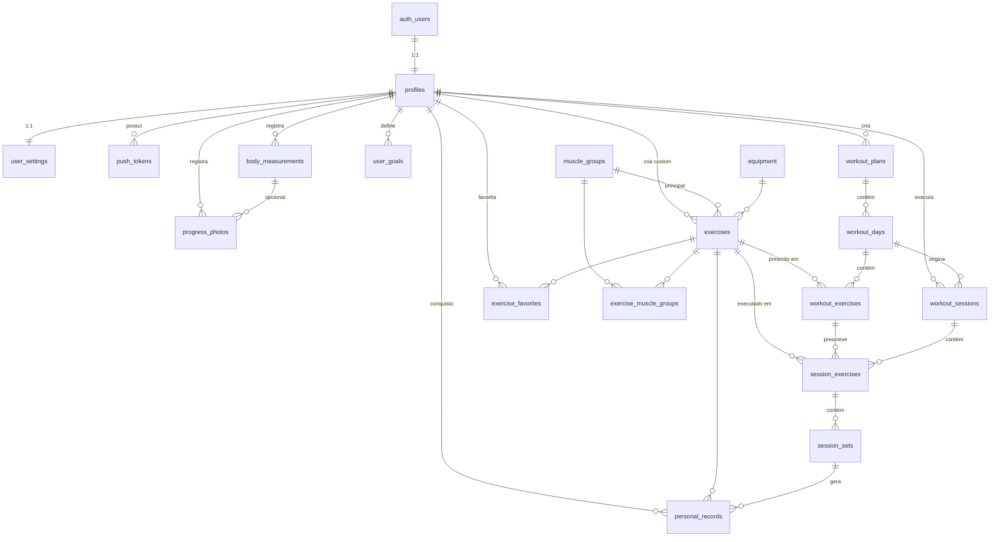

# 02 — Modelo de Dados

[← Voltar ao índice](./README.md)

---

## 1. Diagrama Entidade-Relacionamento



---

## 2. Tipos enumerados (ENUMs)

| Enum | Valores | Usado em |
|---|---|---|
| `gender_type` | `male`, `female`, `other`, `undisclosed` | `profiles` |
| `experience_level` | `beginner`, `intermediate`, `advanced` | `profiles`, `workout_plans`, `exercises` |
| `fitness_goal` | `lose_fat`, `gain_muscle`, `gain_strength`, `endurance`, `health`, `maintenance` | `profiles`, `workout_plans` |
| `unit_system` | `metric`, `imperial` | `user_settings` |
| `theme_preference` | `light`, `dark`, `system` | `user_settings` |
| `body_part` | `upper`, `lower`, `core`, `full_body` | `muscle_groups` |
| `muscle_role` | `primary`, `secondary` | `exercise_muscle_groups` |
| `exercise_mechanic` | `compound`, `isolation` | `exercises` |
| `force_type` | `push`, `pull`, `static` | `exercises` |
| `tracking_type` | `weight_reps`, `reps_only`, `duration`, `distance_duration`, `weight_duration` | `exercises` |
| `plan_source` | `system`, `user`, `coach` | `workout_plans` |
| `session_status` | `in_progress`, `paused`, `completed`, `cancelled` | `workout_sessions` |
| `set_type` | `warmup`, `normal`, `drop`, `failure`, `backoff`, `amrap` | `session_sets` |
| `record_type` | `max_weight`, `max_reps`, `max_volume_set`, `max_volume_session`, `estimated_1rm`, `best_duration`, `best_distance` | `personal_records` |
| `goal_type` | `weekly_sessions`, `body_weight`, `exercise_1rm`, `total_volume`, `body_measurement` | `user_goals` |
| `goal_status` | `active`, `achieved`, `expired`, `cancelled` | `user_goals` |
| `photo_pose` | `front`, `side`, `back`, `other` | `progress_photos` |
| `device_platform` | `ios`, `android` | `push_tokens` |

> **Por que ENUM e não `text` + CHECK?** ENUM garante integridade no banco e vira **union type
> automaticamente** no `database.types.ts` gerado. Adicionar valor é `ALTER TYPE ... ADD VALUE`.

---

## 3. Tabelas — detalhamento

### 🧑 Grupo: Conta e Perfil

#### `profiles`
Espelha `auth.users` (Supabase). Criada automaticamente por trigger no cadastro.

| Coluna | Tipo | Nulo | Padrão | Descrição |
|---|---|---|---|---|
| `id` | `uuid` PK | ✗ | — | FK → `auth.users.id` `ON DELETE CASCADE` |
| `full_name` | `text` | ✓ | — | Nome exibido |
| `username` | `citext` UNIQUE | ✓ | — | 3–20 chars, `[a-z0-9_]` |
| `avatar_path` | `text` | ✓ | — | Caminho no bucket `avatars` (não URL completa) |
| `birth_date` | `date` | ✓ | — | Para calcular idade |
| `gender` | `gender_type` | ✓ | `undisclosed` | |
| `height_cm` | `numeric(5,1)` | ✓ | — | 50–260 |
| `experience_level` | `experience_level` | ✗ | `beginner` | |
| `primary_goal` | `fitness_goal` | ✗ | `gain_muscle` | |
| `weekly_session_goal` | `smallint` | ✗ | `3` | 1–14 |
| `active_plan_id` | `uuid` | ✓ | — | FK → `workout_plans.id` `ON DELETE SET NULL` |
| `onboarding_completed` | `boolean` | ✗ | `false` | Guard de navegação |
| `timezone` | `text` | ✗ | `'America/Sao_Paulo'` | Para agendar lembretes |
| `created_at` / `updated_at` | `timestamptz` | ✗ | `now()` | |

**Regras:** `CHECK (height_cm BETWEEN 50 AND 260)`, `CHECK (weekly_session_goal BETWEEN 1 AND 14)`.

---

#### `user_settings`
Preferências do app. 1:1 com `profiles`, criada pelo mesmo trigger.

| Coluna | Tipo | Padrão | Descrição |
|---|---|---|---|
| `user_id` | `uuid` PK | — | FK → `profiles.id` CASCADE |
| `unit_system` | `unit_system` | `metric` | kg/cm ou lb/in |
| `theme` | `theme_preference` | `system` | |
| `language` | `text` | `'pt-BR'` | |
| `workout_reminders_enabled` | `boolean` | `true` | |
| `reminder_time` | `time` | `'18:00'` | Hora local do usuário |
| `reminder_weekdays` | `smallint[]` | `'{1,3,5}'` | 0=domingo … 6=sábado |
| `rest_timer_auto_start` | `boolean` | `true` | Inicia timer ao marcar série |
| `rest_timer_sound` | `boolean` | `true` | |
| `rest_timer_vibrate` | `boolean` | `true` | |
| `default_rest_seconds` | `smallint` | `90` | Fallback quando não há meta |
| `keep_screen_on` | `boolean` | `true` | Durante o player |
| `weight_increment_kg` | `numeric(4,2)` | `2.5` | Passo dos botões +/− |
| `created_at` / `updated_at` | `timestamptz` | `now()` | |

---

#### `push_tokens`
Tokens de push do Expo, um por dispositivo.

| Coluna | Tipo | Descrição |
|---|---|---|
| `id` | `uuid` PK | |
| `user_id` | `uuid` | FK → `profiles.id` CASCADE |
| `token` | `text` UNIQUE | ExpoPushToken |
| `platform` | `device_platform` | |
| `device_name` | `text` | Ex: "iPhone 15 de Leonardo" |
| `last_used_at` | `timestamptz` | Para limpar tokens mortos |
| `created_at` | `timestamptz` | |

---

### 📚 Grupo: Catálogo (dados globais)

#### `muscle_groups`
Catálogo fixo do sistema (~14 registros). Leitura pública.

| Coluna | Tipo | Descrição |
|---|---|---|
| `id` | `uuid` PK | |
| `slug` | `text` UNIQUE | `chest`, `back`, `quadriceps`… |
| `name_pt` / `name_en` | `text` | "Peito" / "Chest" |
| `body_part` | `body_part` | Para agrupar na UI |
| `color_hex` | `text` | Cor no heatmap muscular |
| `display_order` | `smallint` | Ordem na UI |

**Seed:** Peito, Costas, Ombros, Bíceps, Tríceps, Antebraço, Quadríceps, Posterior de Coxa, Glúteos, Panturrilha, Abdômen, Lombar, Trapézio, Corpo Inteiro.

---

#### `equipment`
Catálogo fixo (~12 registros). Leitura pública.

| Coluna | Tipo | Descrição |
|---|---|---|
| `id` | `uuid` PK | |
| `slug` | `text` UNIQUE | `barbell`, `dumbbell`… |
| `name_pt` / `name_en` | `text` | |
| `icon` | `text` | Nome do ícone Lucide |
| `display_order` | `smallint` | |

**Seed:** Barra, Halter, Máquina, Cabo/Polia, Peso Corporal, Kettlebell, Elástico, Smith, Anilha, Banco, Barra Fixa, Outro.

---

#### `exercises`
Catálogo global **+** exercícios personalizados dos usuários (mesma tabela, diferenciados por `created_by`).

| Coluna | Tipo | Nulo | Descrição |
|---|---|---|---|
| `id` | `uuid` PK | ✗ | |
| `name_pt` / `name_en` | `text` | ✗ / ✓ | "Supino Reto com Barra" |
| `slug` | `text` | ✓ | UNIQUE quando `created_by IS NULL` |
| `description` | `text` | ✓ | |
| `instructions` | `text[]` | ✓ | Passos numerados de execução |
| `tips` | `text[]` | ✓ | Erros comuns / dicas |
| `primary_muscle_group_id` | `uuid` | ✗ | FK → `muscle_groups` RESTRICT |
| `equipment_id` | `uuid` | ✓ | FK → `equipment` SET NULL |
| `mechanic` | `exercise_mechanic` | ✓ | Composto / isolado |
| `force_type` | `force_type` | ✓ | |
| `difficulty` | `experience_level` | ✗ | Default `beginner` |
| `tracking_type` | `tracking_type` | ✗ | **Define os campos do log** (default `weight_reps`) |
| `is_unilateral` | `boolean` | ✗ | Default `false` — se true, UI mostra lado E/D |
| `thumbnail_path` | `text` | ✓ | Bucket `exercise-media` |
| `media_paths` | `text[]` | ✓ | GIF/imagens de execução |
| `video_url` | `text` | ✓ | Link externo (YouTube) ou storage |
| `created_by` | `uuid` | ✓ | **NULL = exercício do sistema.** FK → `profiles` CASCADE |
| `is_public` | `boolean` | ✗ | Default `true` para sistema, `false` para custom |
| `search_vector` | `tsvector` | ✓ | GERADO — busca full-text em PT |
| `created_at` / `updated_at` | `timestamptz` | ✗ | |

> **`tracking_type` é a chave da flexibilidade.** Ele decide quais colunas de `session_sets` a UI mostra:
>
> | tracking_type | Campos na UI | Exemplo |
> |---|---|---|
> | `weight_reps` | carga + reps | Supino, Agachamento |
> | `reps_only` | reps | Flexão, Barra fixa |
> | `duration` | tempo | Prancha |
> | `distance_duration` | distância + tempo | Esteira, Bike |
> | `weight_duration` | carga + tempo | Farmer's walk |

---

#### `exercise_muscle_groups`
N:N — músculos secundários trabalhados.

| Coluna | Tipo | Descrição |
|---|---|---|
| `exercise_id` | `uuid` | PK composta, FK CASCADE |
| `muscle_group_id` | `uuid` | PK composta, FK CASCADE |
| `role` | `muscle_role` | `primary` ou `secondary` |

---

#### `exercise_favorites`

| Coluna | Tipo |
|---|---|
| `user_id` + `exercise_id` | PK composta, ambas FK CASCADE |
| `created_at` | `timestamptz` |

---

### 🏋️ Grupo: Planejamento do treino

#### `workout_plans`
A rotina/programa. Ex: "Treino ABC — Hipertrofia".

| Coluna | Tipo | Nulo | Descrição |
|---|---|---|---|
| `id` | `uuid` PK | ✗ | |
| `owner_id` | `uuid` | ✓ | **NULL = template do sistema.** FK → `profiles` CASCADE |
| `coach_id` | `uuid` | ✓ | 🔮 Reservado para v2 (professor que prescreveu) |
| `name` | `text` | ✗ | |
| `description` | `text` | ✓ | |
| `goal` | `fitness_goal` | ✓ | |
| `level` | `experience_level` | ✓ | |
| `days_per_week` | `smallint` | ✓ | 1–7 |
| `duration_weeks` | `smallint` | ✓ | Duração sugerida |
| `source` | `plan_source` | ✗ | `system` / `user` / `coach` |
| `is_template` | `boolean` | ✗ | Aparece na galeria de templates |
| `cover_path` | `text` | ✓ | |
| `archived_at` | `timestamptz` | ✓ | Soft delete |
| `created_at` / `updated_at` | `timestamptz` | ✗ | |

---

#### `workout_days`
As fichas dentro da rotina (Treino A, B, C…).

| Coluna | Tipo | Nulo | Descrição |
|---|---|---|---|
| `id` | `uuid` PK | ✗ | |
| `plan_id` | `uuid` | ✗ | FK → `workout_plans` CASCADE |
| `name` | `text` | ✗ | "Treino A — Peito e Tríceps" |
| `label` | `text` | ✓ | "A", "B", "Push"… |
| `notes` | `text` | ✓ | |
| `order_index` | `smallint` | ✗ | Ordem dentro do plano |
| `estimated_minutes` | `smallint` | ✓ | Calculado ou informado |
| `scheduled_weekday` | `smallint` | ✓ | 0–6, se a rotina tem dia fixo |
| `created_at` / `updated_at` | `timestamptz` | ✗ | |

**Constraint:** `UNIQUE (plan_id, order_index) DEFERRABLE` — permite reordenar em transação.

---

#### `workout_exercises`
O exercício **prescrito** na ficha, com as metas.

| Coluna | Tipo | Nulo | Descrição |
|---|---|---|---|
| `id` | `uuid` PK | ✗ | |
| `workout_day_id` | `uuid` | ✗ | FK CASCADE |
| `exercise_id` | `uuid` | ✗ | FK → `exercises` RESTRICT |
| `order_index` | `smallint` | ✗ | |
| `target_sets` | `smallint` | ✗ | Default 3 |
| `target_reps_min` | `smallint` | ✓ | Ex: 8 |
| `target_reps_max` | `smallint` | ✓ | Ex: 12 → UI mostra "8–12" |
| `target_weight_kg` | `numeric(6,2)` | ✓ | Carga sugerida |
| `target_duration_seconds` | `smallint` | ✓ | Para exercícios de tempo |
| `target_rest_seconds` | `smallint` | ✗ | Default 90 |
| `target_rpe` | `numeric(3,1)` | ✓ | 1–10 |
| `tempo` | `text` | ✓ | "3-1-1-0" (excêntrica-pausa-concêntrica-pausa) |
| `superset_group` | `smallint` | ✓ | Mesmo número = bi/tri-set |
| `notes` | `text` | ✓ | Observação do exercício na ficha |
| `created_at` / `updated_at` | `timestamptz` | ✗ | |

---

### ▶️ Grupo: Execução (o log de verdade)

#### `workout_sessions`
Um treino realizado.

| Coluna | Tipo | Nulo | Descrição |
|---|---|---|---|
| `id` | `uuid` PK | ✗ | |
| `client_id` | `uuid` UNIQUE | ✗ | 🔑 **Idempotência offline** — gerado no app |
| `user_id` | `uuid` | ✗ | FK → `profiles` CASCADE |
| `plan_id` | `uuid` | ✓ | FK SET NULL — histórico sobrevive se apagar o plano |
| `workout_day_id` | `uuid` | ✓ | FK SET NULL |
| `name` | `text` | ✗ | Copiado da ficha (snapshot) ou "Treino livre" |
| `status` | `session_status` | ✗ | Default `in_progress` |
| `started_at` | `timestamptz` | ✗ | Default `now()` |
| `finished_at` | `timestamptz` | ✓ | |
| `duration_seconds` | `integer` | ✓ | Tempo líquido (desconta pausas) |
| `total_volume_kg` | `numeric(10,2)` | ✗ | 🔄 **Denormalizado por trigger** |
| `total_sets` | `smallint` | ✗ | 🔄 Denormalizado |
| `total_reps` | `integer` | ✗ | 🔄 Denormalizado |
| `perceived_effort` | `smallint` | ✓ | 1–10 |
| `feeling` | `smallint` | ✓ | 1–5 (carinha no resumo) |
| `notes` | `text` | ✓ | |
| `created_at` / `updated_at` | `timestamptz` | ✗ | |

> **Por que denormalizar volume/sets/reps?** O dashboard e os gráficos consultam isso o tempo todo.
> Calcular via `SUM` em milhares de séries a cada abertura de tela seria lento. Um trigger mantém
> os totais sempre corretos.

---

#### `session_exercises`

| Coluna | Tipo | Nulo | Descrição |
|---|---|---|---|
| `id` | `uuid` PK | ✗ | |
| `client_id` | `uuid` UNIQUE | ✗ | Idempotência offline |
| `session_id` | `uuid` | ✗ | FK CASCADE |
| `exercise_id` | `uuid` | ✗ | FK RESTRICT |
| `workout_exercise_id` | `uuid` | ✓ | FK SET NULL — liga ao que foi prescrito |
| `order_index` | `smallint` | ✗ | |
| `notes` | `text` | ✓ | |
| `created_at` / `updated_at` | `timestamptz` | ✗ | |

---

#### `session_sets`
**A tabela mais importante do app.** Cada linha = uma série executada.

| Coluna | Tipo | Nulo | Descrição |
|---|---|---|---|
| `id` | `uuid` PK | ✗ | |
| `client_id` | `uuid` UNIQUE | ✗ | Idempotência offline |
| `session_exercise_id` | `uuid` | ✗ | FK CASCADE |
| `set_number` | `smallint` | ✗ | 1, 2, 3… |
| `set_type` | `set_type` | ✗ | Default `normal` |
| `weight_kg` | `numeric(6,2)` | ✓ | |
| `reps` | `smallint` | ✓ | |
| `duration_seconds` | `integer` | ✓ | |
| `distance_m` | `numeric(8,2)` | ✓ | |
| `rpe` | `numeric(3,1)` | ✓ | |
| `side` | `text` | ✓ | `left` / `right` / NULL (unilateral) |
| `is_completed` | `boolean` | ✗ | Default `false` |
| `rest_taken_seconds` | `smallint` | ✓ | Descanso real medido |
| `volume_kg` | `numeric(10,2)` | GERADO | `weight_kg * reps` (coluna gerada) |
| `notes` | `text` | ✓ | |
| `completed_at` | `timestamptz` | ✓ | |
| `created_at` / `updated_at` | `timestamptz` | ✗ | |

**Constraint:** `UNIQUE (session_exercise_id, set_number, side)`.

---

### 📈 Grupo: Progresso

#### `personal_records`
Recordes atuais do aluno. Mantido automaticamente por trigger.

| Coluna | Tipo | Descrição |
|---|---|---|
| `id` | `uuid` PK | |
| `user_id` | `uuid` | FK CASCADE |
| `exercise_id` | `uuid` | FK CASCADE |
| `record_type` | `record_type` | |
| `value` | `numeric(10,2)` | O valor do recorde |
| `reps` | `smallint` | Reps que geraram o recorde (contexto) |
| `weight_kg` | `numeric(6,2)` | Carga que gerou o recorde |
| `session_set_id` | `uuid` | FK SET NULL — série que originou |
| `achieved_at` | `timestamptz` | |
| `previous_value` | `numeric(10,2)` | Para mostrar "+5 kg 🎉" |

**Constraint:** `UNIQUE (user_id, exercise_id, record_type)` — guarda só o recorde **atual**.
O histórico completo é reconstruível a partir de `session_sets`.

---

#### `body_measurements`

| Coluna | Tipo | Descrição |
|---|---|---|
| `id` | `uuid` PK | |
| `client_id` | `uuid` UNIQUE | Idempotência offline |
| `user_id` | `uuid` | FK CASCADE |
| `measured_on` | `date` | Default `current_date` |
| `weight_kg` | `numeric(5,2)` | |
| `body_fat_percent` | `numeric(4,1)` | |
| `neck_cm`, `shoulder_cm`, `chest_cm`, `waist_cm`, `hip_cm` | `numeric(5,1)` | |
| `arm_left_cm`, `arm_right_cm` | `numeric(5,1)` | |
| `forearm_left_cm`, `forearm_right_cm` | `numeric(5,1)` | |
| `thigh_left_cm`, `thigh_right_cm` | `numeric(5,1)` | |
| `calf_left_cm`, `calf_right_cm` | `numeric(5,1)` | |
| `notes` | `text` | |
| `created_at` / `updated_at` | `timestamptz` | |

**Constraint:** `UNIQUE (user_id, measured_on)` — uma medição por dia (upsert atualiza).

---

#### `progress_photos`
⚠️ Dado sensível. Bucket **privado**, acesso só por URL assinada.

| Coluna | Tipo | Descrição |
|---|---|---|
| `id` | `uuid` PK | |
| `user_id` | `uuid` | FK CASCADE |
| `measurement_id` | `uuid` | FK SET NULL — opcional |
| `storage_path` | `text` | `progress-photos/{user_id}/{uuid}.jpg` |
| `pose` | `photo_pose` | |
| `taken_on` | `date` | |
| `created_at` | `timestamptz` | |

---

#### `user_goals`

| Coluna | Tipo | Descrição |
|---|---|---|
| `id` | `uuid` PK | |
| `user_id` | `uuid` | FK CASCADE |
| `goal_type` | `goal_type` | |
| `exercise_id` | `uuid` | FK CASCADE — só para `exercise_1rm` |
| `title` | `text` | |
| `target_value` | `numeric(10,2)` | |
| `start_value` | `numeric(10,2)` | Para calcular % de progresso |
| `current_value` | `numeric(10,2)` | Atualizado por RPC/trigger |
| `unit` | `text` | `kg`, `sessions`, `cm` |
| `start_date` | `date` | |
| `target_date` | `date` | |
| `status` | `goal_status` | Default `active` |
| `achieved_at` | `timestamptz` | |
| `created_at` / `updated_at` | `timestamptz` | |

---

## 4. Views

| View | Retorna | Usada em |
|---|---|---|
| `v_exercise_last_performance` | Última série registrada por (usuário, exercício): carga, reps, data | Player de treino — "última vez: 60kg × 10" |
| `v_weekly_volume` | Volume total, nº de sessões e duração por semana ISO | Gráfico do dashboard |
| `v_muscle_group_volume` | Volume por grupo muscular nos últimos N dias | Heatmap muscular |

## 5. Funções (RPC)

| Função | Assinatura | O que faz |
|---|---|---|
| `handle_new_user()` | trigger | Cria `profiles` + `user_settings` ao cadastrar |
| `set_updated_at()` | trigger | Mantém `updated_at` |
| `recalc_session_totals()` | trigger | Atualiza `total_volume_kg`, `total_sets`, `total_reps` |
| `check_personal_records()` | trigger | Detecta e grava PRs ao completar série |
| `start_workout_session(p_workout_day_id uuid, p_client_id uuid)` | RPC | Cria sessão + exercícios + séries já pré-preenchidas com as metas |
| `finish_workout_session(p_session_id uuid, p_effort smallint, p_feeling smallint, p_notes text)` | RPC | Fecha a sessão, calcula duração, retorna resumo + PRs conquistados |
| `copy_plan_template(p_plan_id uuid, p_new_name text)` | RPC | Duplica um template do sistema para o usuário |
| `get_dashboard_summary()` | RPC | Streak, sessões da semana, volume, próximo treino — 1 chamada só |
| `get_exercise_history(p_exercise_id uuid, p_limit int)` | RPC | Série temporal para o gráfico do exercício |
| `delete_my_account()` | RPC | Apaga todos os dados do usuário (requisito Apple) |

## 6. Índices planejados

```sql
-- Consultas de histórico (a mais frequente do app)
idx_sessions_user_started      ON workout_sessions (user_id, started_at DESC)
idx_sessions_status            ON workout_sessions (user_id, status) WHERE status = 'in_progress'
idx_session_exercises_session  ON session_exercises (session_id, order_index)
idx_session_sets_parent        ON session_sets (session_exercise_id, set_number)
idx_session_exercises_exercise ON session_exercises (exercise_id)   -- gráfico por exercício

-- Catálogo
idx_exercises_search           GIN ON exercises USING gin(search_vector)
idx_exercises_muscle           ON exercises (primary_muscle_group_id)
idx_exercises_equipment        ON exercises (equipment_id)
idx_exercises_created_by       ON exercises (created_by) WHERE created_by IS NOT NULL

-- Planejamento
idx_days_plan                  ON workout_days (plan_id, order_index)
idx_workout_exercises_day      ON workout_exercises (workout_day_id, order_index)
idx_plans_owner                ON workout_plans (owner_id) WHERE archived_at IS NULL
idx_plans_templates            ON workout_plans (is_template) WHERE is_template = true

-- Progresso
idx_records_user_exercise      ON personal_records (user_id, exercise_id)
idx_measurements_user_date     ON body_measurements (user_id, measured_on DESC)
idx_goals_user_active          ON user_goals (user_id, status) WHERE status = 'active'
```

## 7. Estimativa de volume de dados

Aluno médio: 3 treinos/semana × 6 exercícios × 4 séries = **72 séries/semana** ≈ 3.700 linhas/ano
em `session_sets`. Com 10.000 usuários ativos: ~37M linhas/ano.

**Consequências para o plano:**
- Postgres aguenta isso tranquilamente com os índices acima.
- O free tier do Supabase (500 MB) suporta ~2.000 usuários ativos por um ano. **Planejar upgrade para o plano Pro antes do lançamento.**
- Se um dia passar de ~100M linhas, particionar `session_sets` por ano. **Não é necessário na v1.**

## 8. Preparação para a v2 (módulo de professor)

O modelo já suporta o módulo de coach **sem migration destrutiva**:

| Já previsto | Falta na v2 |
|---|---|
| `workout_plans.coach_id` | Tabela `coach_students` (vínculo professor↔aluno) |
| `workout_plans.source = 'coach'` | Papel `role` em `profiles` (`student` / `coach`) |
| `exercises.created_by` | Políticas RLS adicionais permitindo o coach ler dados do aluno vinculado |

---

[← Arquitetura](./01-arquitetura-tecnica.md) · [Índice](./README.md) · [Próximo: Migrations e SQL →](./03-migrations-e-sql.md)
