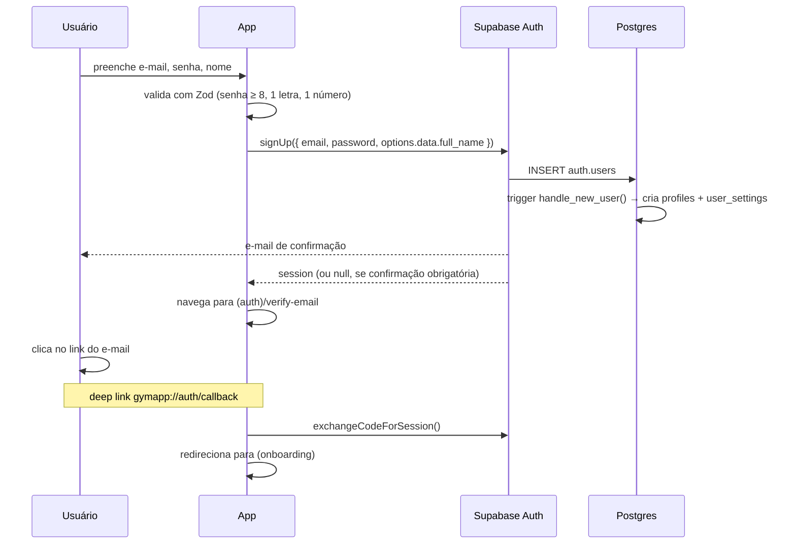

# 04 — Segurança, Autenticação e RLS

[← Voltar ao índice](./README.md)

> **Princípio:** o app roda no dispositivo do usuário e a `anon key` está embutida no binário — qualquer
> pessoa pode extraí-la. Portanto **toda** a segurança tem que estar no banco, via RLS. Nunca confiar
> em filtro feito no cliente.

---

## 1. Fluxo de autenticação

### 1.1 Cadastro (e-mail + senha)



### 1.2 Login

`signInWithPassword({ email, password })` → sessão salva em `expo-secure-store` → `AuthProvider`
escuta `onAuthStateChange` e redireciona.

### 1.3 Recuperação de senha

1. `resetPasswordForEmail(email, { redirectTo: 'gymapp://auth/reset-password' })`
2. Usuário clica no link do e-mail → deep link abre o app
3. App troca o code por sessão e mostra a tela de nova senha
4. `updateUser({ password })`

### 1.4 Renovação de sessão

O `supabase-js` renova o token automaticamente. Configuração obrigatória para React Native:

```ts
// src/lib/supabase/client.ts
import 'react-native-url-polyfill/auto';
import { createClient } from '@supabase/supabase-js';
import * as SecureStore from 'expo-secure-store';
import { AppState, Platform } from 'react-native';
import type { Database } from './database.types';

// SecureStore tem limite de 2048 bytes por item no iOS; o token JWT cabe,
// mas usamos chunking defensivo para não quebrar com metadados grandes.
const SecureStoreAdapter = {
  getItem: (key: string) => SecureStore.getItemAsync(key),
  setItem: (key: string, value: string) => SecureStore.setItemAsync(key, value),
  removeItem: (key: string) => SecureStore.deleteItemAsync(key),
};

export const supabase = createClient<Database>(
  process.env.EXPO_PUBLIC_SUPABASE_URL!,
  process.env.EXPO_PUBLIC_SUPABASE_ANON_KEY!,
  {
    auth: {
      storage: Platform.OS === 'web' ? undefined : SecureStoreAdapter,
      autoRefreshToken: true,
      persistSession: true,
      detectSessionInUrl: false, // obrigatório em RN
    },
  },
);

// Só renova o token com o app em primeiro plano (economiza bateria)
AppState.addEventListener('change', (state) => {
  if (state === 'active') supabase.auth.startAutoRefresh();
  else supabase.auth.stopAutoRefresh();
});
```

### 1.5 Guards de navegação

| Grupo de rotas | Condição | Redireciona para |
|---|---|---|
| `(auth)/*` | já tem sessão | `(app)/(tabs)` |
| `(onboarding)/*` | sem sessão | `(auth)/welcome` |
| `(app)/*` | sem sessão | `(auth)/welcome` |
| `(app)/*` | sessão OK mas `onboarding_completed = false` | `(onboarding)/profile` |

### 1.6 Configuração do Supabase Auth (Dashboard)

| Config | Valor | Motivo |
|---|---|---|
| Confirm email | **Habilitado** | Evita contas com e-mail falso |
| Minimum password length | **8** | |
| Password requirements | Letras + números | |
| JWT expiry | 3600s (1h) | Padrão; refresh token cobre |
| Refresh token rotation | **Habilitado** | Detecta reuso de token roubado |
| Refresh token reuse interval | 10s | |
| Rate limit — sign up | 10/h por IP | Anti-bot |
| Rate limit — sign in | 30/h por IP | |
| Rate limit — e-mail | 4/h por endereço | Evita spam de reset |
| Redirect URLs | `gymapp://auth/callback`, `gymapp://auth/reset-password` | Deep links |
| Site URL | `gymapp://` | |
| Leaked password protection | **Habilitado** (HaveIBeenPwned) | |
| Provedor de e-mail | **SMTP próprio** (Resend/SendGrid/SES) | ⚠️ O SMTP nativo do Supabase é limitado e não serve para produção |

---

## 2. Modelo de autorização

| Nível | Quem enxerga | Tabelas |
|---|---|---|
| **Público autenticado** | Todo usuário logado lê | `muscle_groups`, `equipment` |
| **Catálogo compartilhado** | Lê o que é público **+** o que criou | `exercises`, `exercise_muscle_groups`, `workout_plans` (templates) |
| **Privado do dono** | Só o próprio usuário | Todo o resto (12 tabelas) |
| **Somente escrita pelo sistema** | Cliente só lê; escrita por trigger `SECURITY DEFINER` | `personal_records` |

Nenhum papel de admin no app. Curadoria do catálogo (exercícios do sistema, templates) é feita pelo
Dashboard do Supabase com a `service_role`, que **nunca** sai do servidor.

---

## 3. Políticas RLS — SQL completo

Arquivo: `supabase/migrations/20260813001300_rls.sql`

```sql
-- ═══════════════════════════════════════════════════════════
-- Funções auxiliares (SECURITY DEFINER evita recursão de RLS
-- e melhora muito a performance das políticas aninhadas)
-- ═══════════════════════════════════════════════════════════
create or replace function public.owns_plan(p_plan_id uuid)
returns boolean language sql stable security definer set search_path = public as $$
  select exists (
    select 1 from public.workout_plans p
    where p.id = p_plan_id and p.owner_id = (select auth.uid())
  );
$$;

create or replace function public.owns_day(p_day_id uuid)
returns boolean language sql stable security definer set search_path = public as $$
  select exists (
    select 1 from public.workout_days d
    join public.workout_plans p on p.id = d.plan_id
    where d.id = p_day_id and p.owner_id = (select auth.uid())
  );
$$;

create or replace function public.owns_session(p_session_id uuid)
returns boolean language sql stable security definer set search_path = public as $$
  select exists (
    select 1 from public.workout_sessions s
    where s.id = p_session_id and s.user_id = (select auth.uid())
  );
$$;

create or replace function public.owns_session_exercise(p_se_id uuid)
returns boolean language sql stable security definer set search_path = public as $$
  select exists (
    select 1 from public.session_exercises se
    join public.workout_sessions s on s.id = se.session_id
    where se.id = p_se_id and s.user_id = (select auth.uid())
  );
$$;

create or replace function public.can_read_exercise(p_exercise_id uuid)
returns boolean language sql stable security definer set search_path = public as $$
  select exists (
    select 1 from public.exercises e
    where e.id = p_exercise_id
      and (e.is_public = true or e.created_by = (select auth.uid()))
  );
$$;

-- ═══════════════════════════════════════════════════════════
-- Habilita RLS em TODAS as tabelas
-- ═══════════════════════════════════════════════════════════
alter table public.profiles               enable row level security;
alter table public.user_settings          enable row level security;
alter table public.push_tokens            enable row level security;
alter table public.muscle_groups          enable row level security;
alter table public.equipment              enable row level security;
alter table public.exercises              enable row level security;
alter table public.exercise_muscle_groups enable row level security;
alter table public.exercise_favorites     enable row level security;
alter table public.workout_plans          enable row level security;
alter table public.workout_days           enable row level security;
alter table public.workout_exercises      enable row level security;
alter table public.workout_sessions       enable row level security;
alter table public.session_exercises      enable row level security;
alter table public.session_sets           enable row level security;
alter table public.personal_records       enable row level security;
alter table public.body_measurements      enable row level security;
alter table public.progress_photos        enable row level security;
alter table public.user_goals             enable row level security;

-- ═══════════════════════════════════════════════════════════
-- PERFIL
-- ═══════════════════════════════════════════════════════════
create policy "profile_select_own" on public.profiles
  for select to authenticated using (id = (select auth.uid()));

create policy "profile_update_own" on public.profiles
  for update to authenticated
  using (id = (select auth.uid()))
  with check (id = (select auth.uid()));

-- INSERT/DELETE não têm política: só o trigger e o cascade do auth.users atuam

create policy "settings_all_own" on public.user_settings
  for all to authenticated
  using (user_id = (select auth.uid()))
  with check (user_id = (select auth.uid()));

create policy "push_tokens_all_own" on public.push_tokens
  for all to authenticated
  using (user_id = (select auth.uid()))
  with check (user_id = (select auth.uid()));

-- ═══════════════════════════════════════════════════════════
-- CATÁLOGO (leitura para qualquer logado)
-- ═══════════════════════════════════════════════════════════
create policy "muscle_groups_read" on public.muscle_groups
  for select to authenticated using (true);

create policy "equipment_read" on public.equipment
  for select to authenticated using (true);

-- Exercícios: lê os públicos + os próprios; escreve só os próprios
create policy "exercises_select" on public.exercises
  for select to authenticated
  using (is_public = true or created_by = (select auth.uid()));

create policy "exercises_insert_own" on public.exercises
  for insert to authenticated
  with check (created_by = (select auth.uid()) and is_public = false);

create policy "exercises_update_own" on public.exercises
  for update to authenticated
  using (created_by = (select auth.uid()))
  with check (created_by = (select auth.uid()));

create policy "exercises_delete_own" on public.exercises
  for delete to authenticated
  using (created_by = (select auth.uid()));

create policy "emg_select" on public.exercise_muscle_groups
  for select to authenticated using (public.can_read_exercise(exercise_id));

create policy "emg_write_own_exercise" on public.exercise_muscle_groups
  for all to authenticated
  using (exists (select 1 from public.exercises e
                 where e.id = exercise_id and e.created_by = (select auth.uid())))
  with check (exists (select 1 from public.exercises e
                      where e.id = exercise_id and e.created_by = (select auth.uid())));

create policy "favorites_all_own" on public.exercise_favorites
  for all to authenticated
  using (user_id = (select auth.uid()))
  with check (user_id = (select auth.uid()));

-- ═══════════════════════════════════════════════════════════
-- PLANEJAMENTO
-- ═══════════════════════════════════════════════════════════
create policy "plans_select" on public.workout_plans
  for select to authenticated
  using (owner_id = (select auth.uid()) or is_template = true);

create policy "plans_insert_own" on public.workout_plans
  for insert to authenticated
  with check (owner_id = (select auth.uid()) and is_template = false);

create policy "plans_update_own" on public.workout_plans
  for update to authenticated
  using (owner_id = (select auth.uid()))
  with check (owner_id = (select auth.uid()));

create policy "plans_delete_own" on public.workout_plans
  for delete to authenticated
  using (owner_id = (select auth.uid()));

-- Dias: leitura inclui templates (para o usuário pré-visualizar antes de copiar)
create policy "days_select" on public.workout_days
  for select to authenticated
  using (
    public.owns_plan(plan_id)
    or exists (select 1 from public.workout_plans p
               where p.id = plan_id and p.is_template = true)
  );

create policy "days_write_own" on public.workout_days
  for all to authenticated
  using (public.owns_plan(plan_id))
  with check (public.owns_plan(plan_id));

create policy "wexercises_select" on public.workout_exercises
  for select to authenticated
  using (
    public.owns_day(workout_day_id)
    or exists (select 1 from public.workout_days d
               join public.workout_plans p on p.id = d.plan_id
               where d.id = workout_day_id and p.is_template = true)
  );

create policy "wexercises_write_own" on public.workout_exercises
  for all to authenticated
  using (public.owns_day(workout_day_id))
  with check (public.owns_day(workout_day_id));

-- ═══════════════════════════════════════════════════════════
-- EXECUÇÃO
-- ═══════════════════════════════════════════════════════════
create policy "sessions_all_own" on public.workout_sessions
  for all to authenticated
  using (user_id = (select auth.uid()))
  with check (user_id = (select auth.uid()));

create policy "session_exercises_all_own" on public.session_exercises
  for all to authenticated
  using (public.owns_session(session_id))
  with check (public.owns_session(session_id));

create policy "session_sets_all_own" on public.session_sets
  for all to authenticated
  using (public.owns_session_exercise(session_exercise_id))
  with check (public.owns_session_exercise(session_exercise_id));

-- ═══════════════════════════════════════════════════════════
-- PROGRESSO
-- ═══════════════════════════════════════════════════════════
-- PRs: cliente só lê e apaga. A escrita é feita pelo trigger SECURITY DEFINER.
create policy "records_select_own" on public.personal_records
  for select to authenticated using (user_id = (select auth.uid()));

create policy "records_delete_own" on public.personal_records
  for delete to authenticated using (user_id = (select auth.uid()));

create policy "measurements_all_own" on public.body_measurements
  for all to authenticated
  using (user_id = (select auth.uid()))
  with check (user_id = (select auth.uid()));

create policy "photos_all_own" on public.progress_photos
  for all to authenticated
  using (user_id = (select auth.uid()))
  with check (user_id = (select auth.uid()));

create policy "goals_all_own" on public.user_goals
  for all to authenticated
  using (user_id = (select auth.uid()))
  with check (user_id = (select auth.uid()));

-- ═══════════════════════════════════════════════════════════
-- Bloqueia o papel anônimo em tudo
-- ═══════════════════════════════════════════════════════════
revoke all on all tables in schema public from anon;
```

### Por que `(select auth.uid())` e não `auth.uid()`

Envolver em subquery permite ao Postgres avaliar a função **uma vez** (InitPlan) em vez de uma vez
por linha. Em tabelas grandes como `session_sets` a diferença é de ordem de magnitude. **Padrão
obrigatório em todas as políticas do projeto.**

---

## 4. Storage

Arquivo: `supabase/migrations/20260813001400_storage.sql`

### Buckets

| Bucket | Público | Tamanho máx. | MIME permitidos | Conteúdo |
|---|---|---|---|---|
| `avatars` | ✅ Sim | 2 MB | `image/jpeg`, `image/png`, `image/webp` | Foto de perfil |
| `exercise-media` | ✅ Sim | 10 MB | `image/*`, `video/mp4` | GIFs e vídeos do catálogo |
| `progress-photos` | ❌ **Privado** | 8 MB | `image/jpeg`, `image/png`, `image/webp` | Fotos corporais do aluno |

**Convenção de caminho:** `{user_id}/{uuid}.{ext}` — o primeiro nível da pasta é sempre o ID do dono,
o que permite políticas simples e à prova de erro.

```sql
insert into storage.buckets (id, name, public, file_size_limit, allowed_mime_types) values
  ('avatars',         'avatars',         true,  2097152,  array['image/jpeg','image/png','image/webp']),
  ('exercise-media',  'exercise-media',  true,  10485760, array['image/jpeg','image/png','image/webp','image/gif','video/mp4']),
  ('progress-photos', 'progress-photos', false, 8388608,  array['image/jpeg','image/png','image/webp'])
on conflict (id) do nothing;

-- ── avatars ─────────────────────────────────────────────────
create policy "avatars_public_read" on storage.objects
  for select to public using (bucket_id = 'avatars');

create policy "avatars_write_own" on storage.objects
  for insert to authenticated
  with check (bucket_id = 'avatars'
              and (storage.foldername(name))[1] = (select auth.uid())::text);

create policy "avatars_update_own" on storage.objects
  for update to authenticated
  using (bucket_id = 'avatars'
         and (storage.foldername(name))[1] = (select auth.uid())::text);

create policy "avatars_delete_own" on storage.objects
  for delete to authenticated
  using (bucket_id = 'avatars'
         and (storage.foldername(name))[1] = (select auth.uid())::text);

-- ── exercise-media (leitura pública, escrita só por service_role) ──
create policy "exercise_media_read" on storage.objects
  for select to public using (bucket_id = 'exercise-media');

-- ── progress-photos (100% privado) ──────────────────────────
create policy "progress_photos_own" on storage.objects
  for all to authenticated
  using (bucket_id = 'progress-photos'
         and (storage.foldername(name))[1] = (select auth.uid())::text)
  with check (bucket_id = 'progress-photos'
              and (storage.foldername(name))[1] = (select auth.uid())::text);
```

**No app:** fotos de progresso são acessadas com `createSignedUrl(path, 3600)`, nunca com URL pública.

---

## 5. Edge Function: exclusão de conta

`supabase/functions/delete-account/index.ts`

Necessária porque apagar os arquivos do Storage exige `service_role`.

```ts
import { createClient } from 'jsr:@supabase/supabase-js@2';

Deno.serve(async (req) => {
  const authHeader = req.headers.get('Authorization');
  if (!authHeader) return new Response('Unauthorized', { status: 401 });

  // 1. Valida o usuário com o token dele
  const userClient = createClient(
    Deno.env.get('SUPABASE_URL')!,
    Deno.env.get('SUPABASE_ANON_KEY')!,
    { global: { headers: { Authorization: authHeader } } },
  );
  const { data: { user }, error } = await userClient.auth.getUser();
  if (error || !user) return new Response('Unauthorized', { status: 401 });

  // 2. Com service_role, remove arquivos e o usuário
  const admin = createClient(
    Deno.env.get('SUPABASE_URL')!,
    Deno.env.get('SUPABASE_SERVICE_ROLE_KEY')!,
  );

  for (const bucket of ['avatars', 'progress-photos']) {
    const { data: files } = await admin.storage.from(bucket).list(user.id);
    if (files?.length) {
      await admin.storage.from(bucket).remove(files.map((f) => `${user.id}/${f.name}`));
    }
  }

  // Cascade a partir de auth.users remove todas as linhas do usuário
  const { error: delErr } = await admin.auth.admin.deleteUser(user.id);
  if (delErr) return new Response(delErr.message, { status: 500 });

  return new Response(JSON.stringify({ ok: true }), {
    headers: { 'Content-Type': 'application/json' },
  });
});
```

**Fluxo na UI:** Perfil → Conta → Excluir conta → digitar `EXCLUIR` para confirmar → aviso de que a
ação é irreversível → chama a function → `signOut()` → volta para a tela de boas-vindas.

> ⚠️ **Obrigatório para a App Store.** Guideline 5.1.1(v): app que permite criar conta **precisa**
> permitir excluir a conta pelo próprio app. É motivo comum de rejeição.

---

## 6. Segurança no cliente

| Item | Prática adotada |
|---|---|
| Tokens | `expo-secure-store` (Keychain no iOS, EncryptedSharedPreferences no Android) — nunca `AsyncStorage` |
| Segredos | Só `EXPO_PUBLIC_SUPABASE_ANON_KEY`. `service_role` **jamais** no app |
| Logs | Sem `console.log` de token, e-mail ou dado de saúde em build de produção (regra de ESLint bloqueia) |
| Sentry | `sendDefaultPii: false`; scrub de e-mail e ID; nunca enviar corpo de request |
| Deep links | Validar o parâmetro do link antes de usar; nunca navegar para URL arbitrária vinda de link |
| Screenshots | Não é preciso bloquear na v1 (não há dado financeiro) |
| Certificados | EAS gerencia; **habilitar 2FA** nas contas Apple, Google e Expo |
| Dependências | `npm audit` no CI; Dependabot semanal |
| Ofuscação | ProGuard/R8 habilitado no build Android de produção |

---

## 7. Privacidade e LGPD

O app trata **dado pessoal sensível** (peso, medidas corporais, fotos, informação de saúde). Isso tem
implicações legais e de loja.

### Base legal e direitos do titular

| Requisito LGPD | Como o app atende |
|---|---|
| Consentimento | Aceite explícito dos Termos e da Política de Privacidade no cadastro (checkbox **não** pré-marcado) |
| Finalidade | Política declara: dados usados só para funcionamento do app e evolução do treino |
| Acesso aos dados | Botão "Exportar meus dados" (JSON) em Perfil → Privacidade |
| Correção | Todo dado é editável na própria UI |
| **Eliminação** | Excluir conta (seção 5) — remove tudo em cascata |
| Portabilidade | Exportação em JSON/CSV |
| Minimização | Não coletamos localização, contatos, nem IDs de publicidade |
| Segurança | TLS em trânsito; criptografia em repouso (padrão Supabase); RLS por usuário |
| DPO / contato | E-mail de privacidade publicado na Política e na ficha da loja |

### Documentos obrigatórios antes de publicar

- [ ] **Política de Privacidade** hospedada em URL pública e estável
- [ ] **Termos de Uso** com aviso: *o app não substitui orientação de profissional de educação física ou médica*
- [ ] Ficha da **App Store — App Privacy** ("nutrition labels") preenchida
- [ ] Formulário **Google Play — Data safety** preenchido
- [ ] Declaração de que **não há venda ou compartilhamento** de dados com terceiros

### Dados coletados — mapa para os formulários das lojas

| Categoria | Dado | Vinculado ao usuário | Usado para rastreamento |
|---|---|---|---|
| Contato | E-mail | Sim | Não |
| Identificadores | ID de usuário, token de push | Sim | Não |
| **Saúde e fitness** | Peso, altura, medidas, treinos, fotos | Sim | Não |
| Conteúdo do usuário | Fotos de progresso, notas | Sim | Não |
| Diagnóstico | Crash logs (Sentry) | Não | Não |

---

## 8. Checklist de segurança antes do lançamento

- [ ] `select * from pg_tables where schemaname='public' and rowsecurity=false` retorna **vazio**
- [ ] Nenhuma policy usa `using (true)` para dados de usuário
- [ ] Todas as views têm `security_invoker = true`
- [ ] Toda função `SECURITY DEFINER` tem `set search_path = public`
- [ ] Advisors do Supabase Dashboard (Security + Performance) sem alerta crítico
- [ ] Teste manual com 2 contas: A não vê nada de B (perfil, sessões, fotos, medidas)
- [ ] `service_role` não aparece em nenhum arquivo versionado (`git grep -i service_role`)
- [ ] `.env` está no `.gitignore`
- [ ] SMTP próprio configurado e testado
- [ ] Rate limits do Auth configurados
- [ ] Bucket `progress-photos` confirmado como **privado**
- [ ] Fluxo de excluir conta testado de ponta a ponta
- [ ] Política de Privacidade e Termos publicados e linkados no app
- [ ] 2FA ativo nas contas Apple Developer, Google Play e Expo

---

[← Migrations](./03-migrations-e-sql.md) · [Índice](./README.md) · [Próximo: Mapa de Telas →](./05-mapa-de-telas.md)
