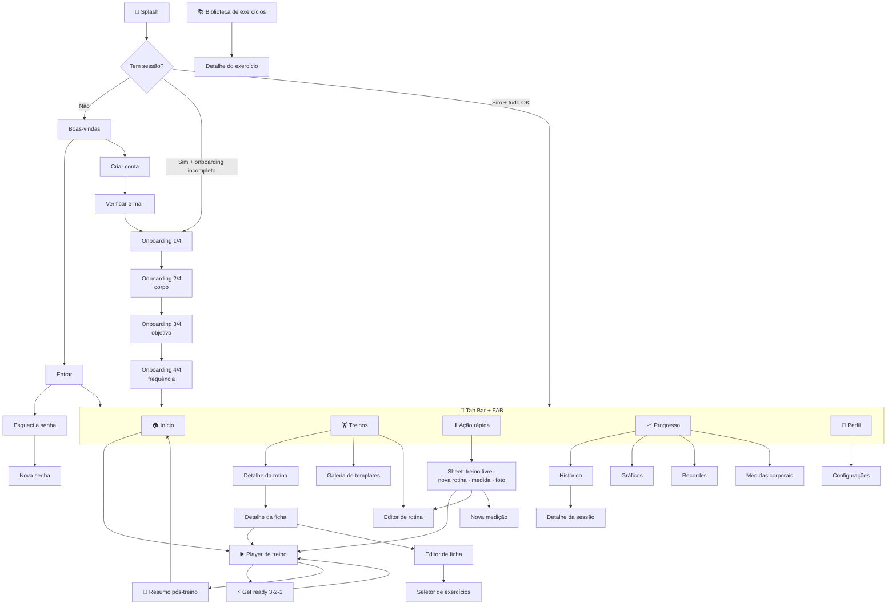

# 05 — Mapa de Telas e Navegação

[← Voltar ao índice](./README.md)

> **v2.** Inventário e navegação atualizados para a linguagem visual da
> [doc 07](./07-design-system-e-ux.md) — tab bar com FAB central, anéis de progresso,
> bento de métricas e modo foco no player. Origem das decisões em [doc 12](./12-referencias-visuais.md).

---

## 1. Árvore de navegação



---

## 2. Inventário completo — 43 telas + 2 overlays

### 🔓 Grupo AUTH (7 telas)

| # | Tela | Rota | Descrição |
|---|---|---|---|
| 1 | Splash | `index.tsx` | Logo lima sobre `#0A0B0A` + verificação de sessão. Máx. 1,5s |
| 2 | Boas-vindas | `(auth)/welcome` | `AuroraBackground` + carrossel de 3 slides + botões Entrar / Criar conta |
| 3 | Entrar | `(auth)/sign-in` | E-mail, senha, mostrar/ocultar senha, "esqueci a senha" |
| 4 | Criar conta | `(auth)/sign-up` | Nome, e-mail, senha, confirmar senha, aceite dos termos |
| 5 | Verificar e-mail | `(auth)/verify-email` | Instrução + reenviar e-mail (cooldown de 60s) |
| 6 | Esqueci a senha | `(auth)/forgot-password` | E-mail + confirmação de envio |
| 7 | Nova senha | `(auth)/reset-password` | Nova senha + confirmação (via deep link) |

### 📋 Grupo ONBOARDING (4 telas)

| # | Tela | Rota | Campos |
|---|---|---|---|
| 8 | Perfil | `(onboarding)/profile` | Nome, data de nascimento, sexo, foto (opcional) |
| 9 | Corpo | `(onboarding)/body` | Altura, peso atual, unidade (kg/lb) |
| 10 | Objetivo | `(onboarding)/goal` | Objetivo principal (6 cards) + nível de experiência |
| 11 | Frequência | `(onboarding)/frequency` | Dias/semana, dias preferidos, lembretes + horário |

> Barra de progresso (1/4 … 4/4), botão Voltar e "Pular por enquanto" (exceto a 1ª).
> Ao concluir: `onboarding_completed = true` e sugestão de template compatível.

### 🏠 Grupo TABS (4 telas + 1 modal do FAB)

| # | Tela | Rota | Descrição |
|---|---|---|---|
| 12 | Início | `(app)/(tabs)/index` | Dashboard — anel de meta + bento + streak |
| 13 | Treinos | `(app)/(tabs)/workouts` | Rotinas do usuário + templates, em `HeroCard` |
| 14 | Progresso | `(app)/(tabs)/progress` | Hub de evolução |
| 15 | Perfil | `(app)/(tabs)/profile` | Dados + acesso às configurações |
| 43 🆕 | **Ação rápida** | `(modals)/quick-action` | Sheet do FAB central: treino livre · nova rotina · medida · foto |

### 🏋️ Grupo TREINOS (7 telas)

| # | Tela | Rota | Descrição |
|---|---|---|---|
| 16 | Detalhe da rotina | `(app)/plan/[id]` | Lista de fichas, estatísticas, ações (editar, duplicar, arquivar, definir como ativa) |
| 17 | Nova rotina | `(app)/plan/new` | Nome, objetivo, nível, dias/semana |
| 18 | Editar rotina | `(app)/plan/[id]/edit` | Mesmos campos + reordenar/adicionar/remover fichas |
| 19 | Galeria de templates | `(app)/plan/templates` | `HeroCard`s com `FilterBar` por nível e objetivo |
| 20 | Detalhe da ficha | `(app)/day/[id]` | Herói + prescrição + **Iniciar treino** |
| 21 | Editar ficha | `(app)/day/[id]/edit` | Drag-and-drop, metas por exercício, bi-set |
| 22 | Seletor de exercícios | `(modals)/exercise-picker` | Modal de busca com filtros e seleção múltipla |

### ▶️ Grupo EXECUÇÃO (5 telas + 2 overlays)

| # | Tela | Rota | Descrição |
|---|---|---|---|
| 23 | **Player de treino** | `(app)/session/active` | ⭐ Tela mais importante. Dois modos: lista (padrão) e foco |
| — 🆕 | *Get ready* | overlay | Tela cheia lima com 3-2-1 antes da primeira série |
| — 🆕 | *Modo foco* | `?mode=focus` | Um exercício por vez, `RepCounter` gigante |
| 24 | Timer de descanso | `(modals)/rest-timer` | Sheet com contagem regressiva |
| 25 | Editor de série | `(modals)/set-editor` | Sheet para tipo de série, RPE, notas |
| 26 | Resumo pós-treino | `(app)/session/summary/[id]` | `CelebrationSheet` + bento + PRs |
| 27 | Detalhe de sessão | `(app)/session/[id]` | Sessão passada, read-only, com opção de editar |

### 📚 Grupo EXERCÍCIOS (3 telas)

| # | Tela | Rota | Descrição |
|---|---|---|---|
| 28 | Biblioteca | `(app)/exercise/library` | `FilterBar` + busca + chips + favoritos |
| 29 | Detalhe do exercício | `(app)/exercise/[id]` | Herói, instruções, músculos, histórico, gráfico, PRs |
| 30 | Novo exercício | `(app)/exercise/new` | Criar exercício personalizado |

### 📈 Grupo PROGRESSO (5 telas)

| # | Tela | Rota | Descrição |
|---|---|---|---|
| 31 | Histórico | `(app)/progress/history` | Lista paginada + calendário mensal |
| 32 | Gráficos | `(app)/progress/charts` | Volume semanal, distribuição, frequência |
| 33 | Recordes | `(app)/progress/records` | PRs agrupados por grupo muscular |
| 34 | Medidas corporais | `(app)/body/measurements` | Lista + gráfico de peso e circunferências |
| 35 | Nova medição | `(app)/body/new-measurement` | Formulário com campos colapsáveis |

### 🎯 Grupo METAS + CORPO (3 telas)

| # | Tela | Rota | Descrição |
|---|---|---|---|
| 36 | Minhas metas | `(app)/goals/index` | `RingStat` por meta |
| 37 | Nova meta | `(app)/goals/new` | Tipo, valor alvo, prazo |
| 38 | Fotos de progresso | `(app)/body/photos` | Grade por data + comparador lado a lado |

### ⚙️ Grupo CONFIGURAÇÕES (4 telas)

| # | Tela | Rota | Descrição |
|---|---|---|---|
| 39 | Configurações | `(app)/settings/index` | Menu: conta, notificações, aparência, unidades, privacidade, sobre |
| 40 | Conta | `(app)/settings/account` | Editar e-mail, trocar senha, **excluir conta** |
| 41 | Notificações | `(app)/settings/notifications` | Lembretes, horário, dias, sons e vibração |
| 42 | Privacidade | `(app)/settings/privacy` | Política, termos, exportar dados |

> **Aparência** e **Unidades** são resolvidas em sheets a partir de Configurações.

---

## 3. Wireframes das telas críticas

### 🏠 Início (Dashboard)

Anel primeiro, bento depois, listas por último. O olho responde "estou em dia?" antes de ler nada.

```
┌──────────────────────────────────────┐
│  Bom dia, Leonardo            [👤]   │
│                                       │
│  ┌─────────────────────────────────┐ │
│  │   ╭─────╮                       │ │
│  │   │ 2/3 │   ESTA SEMANA         │ │  ← RingStat lg, lima
│  │   │▓▓▓░ │   Falta 1 pra fechar  │ │
│  │   ╰─────╯                       │ │
│  │   S  T  Q  Q  S  S  D           │ │  ← StreakStrip
│  │   ✓  ✓  ◉  ·  ·  ·  ·           │ │
│  └─────────────────────────────────┘ │
│                                       │
│  ┌─────────────────────────────────┐ │
│  │ ▶ CONTINUAR TREINO              │ │  ← só se houver sessão
│  │   Treino A · 12 min · 3 séries  │ │     in_progress
│  └─────────────────────────────────┘ │
│                                       │
│  ┌─────────────────────────────────┐ │
│  │ [capa cor do grupo muscular]    │ │  ← HeroCard
│  │  PRÓXIMO TREINO                 │ │
│  │  Treino B — Costas e Bíceps     │ │
│  │  ⏱ ~55 min  🎯 Costas  📊 Interm.│ │  ← MetaChips
│  │      [ INICIAR TREINO ]         │ │  ← CTA lima, texto tinta
│  └─────────────────────────────────┘ │
│                                       │
│  ESTA SEMANA                          │  ← overline
│  ┌──────────────┬──────────────────┐ │
│  │  12,4 t      │   2h15           │ │  ← BentoGrid 2×2
│  │  volume      │   tempo          │ │     número em `metric`
│  ├──────────────┼──────────────────┤ │
│  │  🔥 4        │   18             │ │
│  │  semanas     │   séries         │ │
│  └──────────────┴──────────────────┘ │
│                                       │
│  VOLUME · 8 SEMANAS                   │
│  ┌─────────────────────────────────┐ │
│  │      ▁▃▅▇▆█▇▉                   │ │
│  └─────────────────────────────────┘ │
│                                       │
│  ÚLTIMOS RECORDES                     │
│  🏆 Supino Reto    80 kg  +2,5  há 3d│
│  🏆 Agachamento   120 kg  +5,0  há 5d│
│                                       │
├──────────────────────────────────────┤
│  🏠    🏋️    ( ➕ )    📈    👤      │  ← FAB central lima
└──────────────────────────────────────┘
```

**Regra:** o CTA principal nunca fica a mais de um toque. Se há sessão ativa, "Continuar" tem
prioridade visual sobre "Iniciar".

---

### ▶️ Player — modo lista (padrão)

O modo de quem registra carga. É o padrão porque é o uso real na academia.

```
┌──────────────────────────────────────┐
│ ✕   Treino A      ╭───╮  ⏱24:15  ⋮  │  ← RingStat sm = 8/18
│                   │44%│               │     cronômetro tabular
│                   ╰───╯               │
├──────────────────────────────────────┤
│  ┌─────────────────────────────────┐ │
│  │ [■] Supino Reto com Barra    ⋮  │ │  ← bloco na cor do grupo
│  │     Peito · Barra                │ │
│  │  📌 Última vez: 75 kg × 10       │ │
│  ├─────────────────────────────────┤ │
│  │ SÉR  ANTERIOR   KG     REPS   ✓ │ │
│  │  1   75×10    [ 75 ] [ 10 ]  ☑ │ │  ← lima, concluída
│  │  2   75×10    [ 75 ] [ 10 ]  ☑ │ │
│  │  3   75×9     [77,5] [ 10 ]  ☐ │ │  ← atual, borda lima
│  │  4   —        [77,5] [  8 ]  ☐ │ │
│  │  + Adicionar série              │ │
│  └─────────────────────────────────┘ │
│                                       │
│  ┌─────────────────────────────────┐ │
│  │ [■] Supino Inclinado Halter  ⋮  │ │  ← próximo, recolhido
│  │     3 séries · 10-12 reps        │ │
│  └─────────────────────────────────┘ │
│  + Adicionar exercício                │
├──────────────────────────────────────┤
│  ⏸ DESCANSO  01:23         [ +15s ]  │  ← barra sobe do rodapé
├──────────────────────────────────────┤
│         [  FINALIZAR TREINO  ]        │
└──────────────────────────────────────┘
```

### ⚡ Get ready 🆕

Aparece uma vez, antes da primeira série. Tela cheia lima, tinta escura, 3-2-1.

```
┌──────────────────────────────────────┐
│                                       │
│                                       │
│                                       │
│               3                       │  ← metricXl, escala 1.2→1
│                                       │
│          Supino Reto                  │
│          4 séries · 75 kg             │
│                                       │
│                                       │
│              [ Pular ]                │
└──────────────────────────────────────┘
```

### 🎯 Player — modo foco 🆕

Alternado pelo `⋮`. Um exercício por vez, para quem segue prescrição sem ajustar carga.

```
┌──────────────────────────────────────┐
│ ✕                          ⏱ 24:15   │
│  ┌─────────────────────────────────┐ │
│  │ [ bloco na cor do grupo         │ │
│  │   muscular, 260pt ]             │ │
│  │                                  │ │
│  │            10                    │ │  ← RepCounter, metricXl
│  │                                  │ │
│  │   Supino Reto · Série 3 de 4     │ │
│  │   ▓▓▓▓▓▓▓░░░░                    │ │
│  └─────────────────────────────────┘ │
│                                       │
│   77,5 kg          10 reps            │  ← metric + caption
│                                       │
│  [ ← Anterior ]      [ Próxima → ]    │
│                                       │
│         Ver todas as séries           │  ← volta ao modo lista
└──────────────────────────────────────┘
```

**Comportamentos obrigatórios (os dois modos):**

| Ação | Comportamento |
|---|---|
| Marcar série (☑) | Haptic de sucesso · timer de descanso inicia automaticamente · foco vai para a próxima série |
| Campos de kg/reps | Teclado numérico · botões +/− com passo configurável · pré-preenchidos com a meta ou a última performance |
| Fim do descanso | Notificação local + som + vibração (mesmo em segundo plano ou tela bloqueada) |
| Swipe na linha da série | Revela ações: excluir · marcar como aquecimento/falha |
| Sem internet | Tudo funciona; badge discreto "offline" no topo; sincroniza sozinho ao voltar |
| Fechar o app | Estado persistido; ao reabrir mostra "Retomar treino?" |
| Tela | `expo-keep-awake` mantém ligada (configurável) |
| Sair (✕) | Confirmação: Continuar depois · Descartar treino · Cancelar |
| Trocar de modo | Preserva a série atual e o timer; preferência fica em `user_settings` |

---

### 🎉 Resumo pós-treino

```
┌──────────────────────────────────────┐
│  ┌─────────────────────────────────┐ │
│  │        ╭─────────╮              │ │  ← CelebrationSheet lima
│  │        │    ✓    │              │ │     círculo tinta escura
│  │        ╰─────────╯              │ │
│  │      TREINO CONCLUÍDO           │ │
│  └─────────────────────────────────┘ │
│                                       │
│  ┌──────────┬──────────┬───────────┐ │
│  │  52 min  │ 4.850 kg │    18     │ │  ← BentoGrid
│  │  duração │  volume  │  séries   │ │
│  └──────────┴──────────┴───────────┘ │
│                                       │
│  2 NOVOS RECORDES                     │
│  ┌─────────────────────────────────┐ │
│  │ 🏆 Supino Reto                  │ │  ← dourado (accent.pr)
│  │    77,5 kg  ▲ +2,5 kg           │ │
│  ├─────────────────────────────────┤ │
│  │ 🏆 Tríceps na Polia             │ │
│  │    1RM estimado 52 kg  ▲ +3 kg  │ │
│  └─────────────────────────────────┘ │
│                                       │
│  COMO FOI O TREINO?                   │
│      😫   😕   😐   🙂   😄           │
│  Esforço percebido       [ 7 /10 ]    │
│  ┌─────────────────────────────────┐ │
│  │ Anotações (opcional)            │ │
│  └─────────────────────────────────┘ │
│                                       │
│  [ Compartilhar ]     [ CONCLUIR ]    │
└──────────────────────────────────────┘
```

---

### 📚 Biblioteca de exercícios

```
┌──────────────────────────────────────┐
│ ←  Exercícios                   [+]  │
│  ┌────────┬─────────┬──────────────┐ │
│  │⚙Filtros│↕Ordenar │🔍 Buscar     │ │  ← FilterBar
│  └────────┴─────────┴──────────────┘ │
│  ( Todos )( ⭐ Favoritos )( Meus )   │  ← PillTabs
│  Grupo: (Todos)(Peito)(Costas)(...)  │  ← chips roláveis
├──────────────────────────────────────┤
│  PEITO                                │  ← overline
│  ┌──┐ Supino Reto com Barra      ⭐  │
│  │██│ Barra · Composto                │  ← bloco na cor do grupo
│  └──┘                                 │
│  ┌──┐ Supino Inclinado Halteres      │
│  │██│ Halter · Composto               │
│  └──┘                                 │
│  ┌──┐ Crucifixo na Polia              │
│  │██│ Cabo · Isolado                  │
│  └──┘                                 │
│  COSTAS                               │
│  ...                                  │
└──────────────────────────────────────┘
```

Busca com **debounce de 300ms**, full-text no Postgres (`search_vector`), sem acento e sem
diferenciar maiúsculas. Lista com FlashList e seções por grupo muscular.

---

### 📈 Progresso (hub)

```
┌──────────────────────────────────────┐
│  Progresso                            │
│  ( 4 sem )( 3 meses )( 6 meses )(Ano)│  ← PillTabs
│                                       │
│  ┌─────────────────────────────────┐ │
│  │      ╭───────────╮              │ │  ← GaugeArc 240°
│  │     ╱   48,2 t    ╲             │ │     volume vs. meta
│  │    │   ▲ 12%       │            │ │
│  │     ╲  vs anterior╱             │ │
│  │      ╰───────────╯              │ │
│  └─────────────────────────────────┘ │
│                                       │
│  POR GRUPO MUSCULAR                   │
│  Peito     ████████░░  32%           │
│  Costas    ███████░░░  28%           │
│  Pernas    █████░░░░░  22%           │
│  Ombros    ███░░░░░░░  11%           │
│  Braços    ██░░░░░░░░   7%           │
│                                       │
│  FREQUÊNCIA                           │
│  ┌─────────────────────────────────┐ │
│  │ ▪▪▫▪▫▪▫ ▪▪▪▫▫▪▫ ▪▫▪▫▪▫▫         │ │  ← heatmap
│  └─────────────────────────────────┘ │
│                                       │
│  ›  🏆 Recordes pessoais          14 │
│  ›  📋 Histórico de treinos       87 │
│  ›  ⚖️  Medidas corporais            │
│  ›  📸 Fotos de progresso            │
│  ›  🎯 Metas                       3 │
└──────────────────────────────────────┘
```

---

### ➕ Ação rápida (sheet do FAB) 🆕

```
┌──────────────────────────────────────┐
│              ▬▬▬▬                     │
│                                       │
│  ▶  Iniciar treino livre              │
│     Sem ficha, monta na hora          │
│                                       │
│  📋 Nova rotina                       │
│     Do zero ou a partir de um template│
│                                       │
│  ⚖️  Registrar medida                 │
│     Peso e circunferências            │
│                                       │
│  📸 Nova foto de progresso            │
│                                       │
└──────────────────────────────────────┘
```

Reduz de 3 toques para 2 as quatro ações mais frequentes fora do fluxo de treino.

---

## 4. Padrões transversais de UI

### Estados obrigatórios em toda tela com dados

| Estado | Tratamento |
|---|---|
| **Loading** | Skeleton com o formato do conteúdo real (nunca spinner de tela cheia) |
| **Empty** | Ilustração + frase explicativa + botão de ação. Ex: "Você ainda não tem rotinas — Criar minha primeira" |
| **Error** | Mensagem em linguagem humana + botão "Tentar novamente" |
| **Offline** | Banner discreto no topo: "Sem conexão — suas alterações serão sincronizadas" |
| **Success** | Toast de 3s, não bloqueante |

### Navegação

| Padrão | Regra |
|---|---|
| Tab bar | Sempre visível, **exceto** no player de treino e em modais |
| FAB central | Presente sempre que a tab bar está; abre o sheet de ação rápida |
| Header | Título + botão voltar à esquerda + ação contextual à direita |
| Modais | Bottom sheets para escolhas rápidas; tela cheia para formulários |
| Gesto de voltar | Sempre habilitado (swipe da borda no iOS), exceto no player |
| Deep links | `gymapp://plan/[id]`, `gymapp://session/[id]`, `gymapp://auth/*` |

### Feedback tátil (`expo-haptics`)

| Evento | Tipo |
|---|---|
| Marcar série concluída | `impactAsync(Medium)` |
| Novo recorde pessoal | `notificationAsync(Success)` |
| Fim do descanso | `notificationAsync(Success)` + som |
| Erro de validação | `notificationAsync(Error)` |
| Toque em botão primário | `impactAsync(Light)` |
| Cada dígito do "get ready" 🆕 | `impactAsync(Light)`; o "vai" usa `Medium` |

---

## 5. Mapa tela × tabela do banco

| Tela | Lê | Escreve |
|---|---|---|
| Início | `get_dashboard_summary()`, `v_weekly_volume`, `personal_records` | — |
| Treinos | `workout_plans`, `workout_days` | — |
| Detalhe da ficha | `workout_exercises`, `exercises`, `v_exercise_last_performance` | — |
| Editor de ficha | `exercises` | `workout_exercises`, `workout_days` |
| **Player** | `start_workout_session()`, `v_exercise_last_performance` | `session_sets`, `session_exercises`, `workout_sessions` |
| Resumo | `finish_workout_session()` | `workout_sessions` |
| Biblioteca | `exercises`, `muscle_groups`, `equipment`, `exercise_favorites` | `exercise_favorites` |
| Detalhe do exercício | `get_exercise_history()`, `personal_records` | — |
| Progresso | `v_weekly_volume`, `v_muscle_group_volume` | — |
| Histórico | `workout_sessions` (paginado) | — |
| Medidas | `body_measurements` | `body_measurements` |
| Fotos | `progress_photos` + signed URLs | `progress_photos`, Storage |
| Metas | `user_goals` | `user_goals` |
| Perfil / Config | `profiles`, `user_settings` | `profiles`, `user_settings`, Storage |
| Ação rápida 🆕 | — | roteia para as telas acima |
| Excluir conta | — | Edge Function `delete-account` |

> Nenhuma tela nova da v2 exige tabela nova. O anel de meta, o bento, a faixa de streak e a
> duração estimada saem de dados que o banco já entrega — ver [doc 12, §4.1](./12-referencias-visuais.md).

---

[← Segurança e RLS](./04-seguranca-rls-e-auth.md) · [Índice](./README.md) · [Próximo: Funcionalidades →](./06-funcionalidades-e-user-stories.md)
