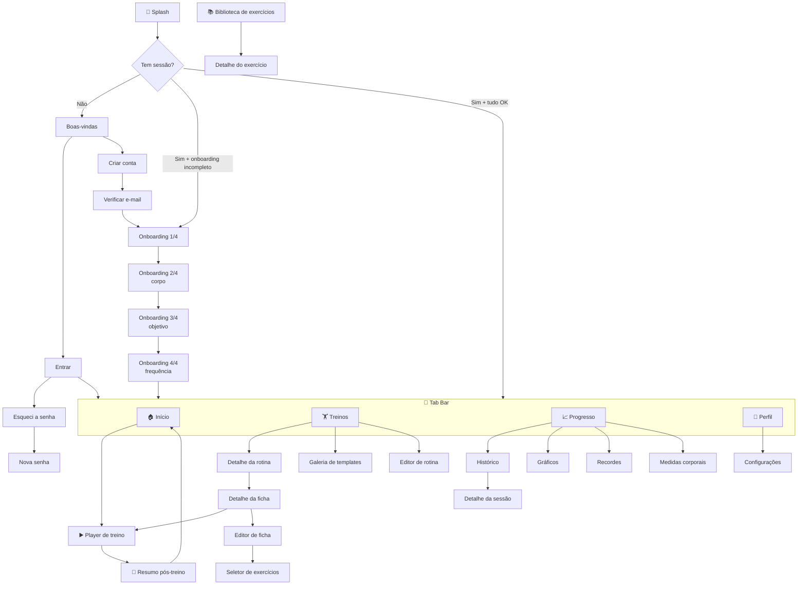

# 05 — Mapa de Telas e Navegação

[← Voltar ao índice](./README.md)

---

## 1. Árvore de navegação



---

## 2. Inventário completo — 42 telas

### 🔓 Grupo AUTH (7 telas)

| # | Tela | Rota | Descrição |
|---|---|---|---|
| 1 | Splash | `index.tsx` | Logo + verificação de sessão. Redireciona. Máx. 1,5s |
| 2 | Boas-vindas | `(auth)/welcome` | Carrossel de 3 slides com os benefícios + botões Entrar / Criar conta |
| 3 | Entrar | `(auth)/sign-in` | E-mail, senha, mostrar/ocultar senha, "esqueci a senha" |
| 4 | Criar conta | `(auth)/sign-up` | Nome, e-mail, senha, confirmar senha, aceite dos termos |
| 5 | Verificar e-mail | `(auth)/verify-email` | Instrução + reenviar e-mail (com cooldown de 60s) |
| 6 | Esqueci a senha | `(auth)/forgot-password` | E-mail + confirmação de envio |
| 7 | Nova senha | `(auth)/reset-password` | Nova senha + confirmação (acessada via deep link) |

### 📋 Grupo ONBOARDING (4 telas)

| # | Tela | Rota | Campos |
|---|---|---|---|
| 8 | Perfil | `(onboarding)/profile` | Nome, data de nascimento, sexo, foto (opcional) |
| 9 | Corpo | `(onboarding)/body` | Altura, peso atual, unidade (kg/lb) |
| 10 | Objetivo | `(onboarding)/goal` | Objetivo principal (6 cards) + nível de experiência |
| 11 | Frequência | `(onboarding)/frequency` | Dias/semana, dias preferidos, ativar lembretes + horário |

> Todas com barra de progresso (1/4 … 4/4), botão Voltar e "Pular por enquanto" (exceto a 1ª).
> Ao concluir: `onboarding_completed = true` e sugestão de template compatível com objetivo + nível.

### 🏠 Grupo TABS (4 telas principais)

| # | Tela | Rota | Descrição |
|---|---|---|---|
| 12 | Início | `(app)/(tabs)/index` | Dashboard |
| 13 | Treinos | `(app)/(tabs)/workouts` | Rotinas do usuário + templates |
| 14 | Progresso | `(app)/(tabs)/progress` | Hub de evolução |
| 15 | Perfil | `(app)/(tabs)/profile` | Dados + acesso às configurações |

### 🏋️ Grupo TREINOS (7 telas)

| # | Tela | Rota | Descrição |
|---|---|---|---|
| 16 | Detalhe da rotina | `(app)/plan/[id]` | Lista de fichas, estatísticas, ações (editar, duplicar, arquivar, definir como ativa) |
| 17 | Nova rotina | `(app)/plan/new` | Nome, objetivo, nível, dias/semana |
| 18 | Editar rotina | `(app)/plan/[id]/edit` | Mesmos campos + reordenar/adicionar/remover fichas |
| 19 | Galeria de templates | `(app)/plan/templates` | Cards dos treinos prontos com filtro por nível e objetivo |
| 20 | Detalhe da ficha | `(app)/day/[id]` | Lista de exercícios prescritos + botão **Iniciar treino** |
| 21 | Editar ficha | `(app)/day/[id]/edit` | Drag-and-drop, editar metas por exercício, criar bi-set |
| 22 | Seletor de exercícios | `(modals)/exercise-picker` | Modal de busca com filtros e seleção múltipla |

### ▶️ Grupo EXECUÇÃO (5 telas)

| # | Tela | Rota | Descrição |
|---|---|---|---|
| 23 | **Player de treino** | `(app)/session/active` | ⭐ Tela mais importante do app |
| 24 | Timer de descanso | `(modals)/rest-timer` | Sheet com contagem regressiva |
| 25 | Editor de série | `(modals)/set-editor` | Sheet para ajustar tipo de série, RPE, notas |
| 26 | Resumo pós-treino | `(app)/session/summary/[id]` | Celebração + estatísticas + PRs |
| 27 | Detalhe de sessão | `(app)/session/[id]` | Sessão passada, read-only, com opção de editar |

### 📚 Grupo EXERCÍCIOS (3 telas)

| # | Tela | Rota | Descrição |
|---|---|---|---|
| 28 | Biblioteca | `(app)/exercise/library` | Busca, filtros por grupo muscular e equipamento, favoritos |
| 29 | Detalhe do exercício | `(app)/exercise/[id]` | Mídia, instruções, músculos, histórico pessoal, gráfico, PRs |
| 30 | Novo exercício | `(app)/exercise/new` | Criar exercício personalizado |

### 📈 Grupo PROGRESSO (5 telas)

| # | Tela | Rota | Descrição |
|---|---|---|---|
| 31 | Histórico | `(app)/progress/history` | Lista paginada de sessões + calendário mensal |
| 32 | Gráficos | `(app)/progress/charts` | Volume semanal, distribuição por grupo muscular, frequência |
| 33 | Recordes | `(app)/progress/records` | Lista de PRs agrupada por grupo muscular |
| 34 | Medidas corporais | `(app)/body/measurements` | Lista + gráfico de peso e circunferências |
| 35 | Nova medição | `(app)/body/new-measurement` | Formulário com todos os campos (colapsáveis) |

### 🎯 Grupo METAS + CORPO (3 telas)

| # | Tela | Rota | Descrição |
|---|---|---|---|
| 36 | Minhas metas | `(app)/goals/index` | Cards com barra de progresso |
| 37 | Nova meta | `(app)/goals/new` | Tipo, valor alvo, prazo |
| 38 | Fotos de progresso | `(app)/body/photos` | Grade por data + comparador lado a lado |

### ⚙️ Grupo CONFIGURAÇÕES (4 telas)

| # | Tela | Rota | Descrição |
|---|---|---|---|
| 39 | Configurações | `(app)/settings/index` | Menu: conta, notificações, aparência, unidades, privacidade, sobre |
| 40 | Conta | `(app)/settings/account` | Editar e-mail, trocar senha, **excluir conta** |
| 41 | Notificações | `(app)/settings/notifications` | Lembretes, horário, dias, sons e vibração do timer |
| 42 | Privacidade | `(app)/settings/privacy` | Política, termos, exportar dados |

> **Aparência** e **Unidades** são resolvidas em sheets a partir de Configurações, não em telas próprias.

---

## 3. Wireframes das telas críticas

### 🏠 Início (Dashboard)

```
┌──────────────────────────────────────┐
│  Bom dia, Leonardo 👋        [👤]    │
│                                       │
│  ┌─────────────────────────────────┐ │
│  │ ▶  CONTINUAR TREINO             │ │  ← só aparece se houver
│  │    Treino A · 12 min · 3 séries │ │     sessão in_progress
│  └─────────────────────────────────┘ │
│                                       │
│  ┌─────────────────────────────────┐ │
│  │ PRÓXIMO TREINO                  │ │
│  │ Treino B — Costas e Bíceps      │ │
│  │ 7 exercícios · ~55 min          │ │
│  │        [ INICIAR TREINO ]       │ │  ← CTA primário, grande
│  └─────────────────────────────────┘ │
│                                       │
│  ESTA SEMANA                          │
│  ┌───────┬───────┬───────┬─────────┐ │
│  │ 2/3   │ 12.4t │ 🔥 4  │  2h15   │ │
│  │treinos│volume │semanas│  tempo  │ │
│  └───────┴───────┴───────┴─────────┘ │
│  ●●○  D S T Q Q S S                  │
│                                       │
│  VOLUME (8 semanas)                   │
│  ┌─────────────────────────────────┐ │
│  │      ▁▃▅▇▆█▇▉                   │ │
│  └─────────────────────────────────┘ │
│                                       │
│  🏆 ÚLTIMOS RECORDES                  │
│  Supino Reto      80 kg   +2,5  há 3d│
│  Agachamento     120 kg   +5,0  há 5d│
│                                       │
├──────────────────────────────────────┤
│  🏠      🏋️      📈      👤          │
└──────────────────────────────────────┘
```

**Regra:** o CTA principal nunca fica a mais de um toque. Se há sessão ativa, "Continuar" tem
prioridade visual sobre "Iniciar".

---

### ▶️ Player de treino — a tela mais importante

```
┌──────────────────────────────────────┐
│ ✕   Treino A            ⏱ 24:15  ⋮   │  ← cronômetro sempre visível
│ ▓▓▓▓▓▓▓▓░░░░░░░  8/18 séries         │
├──────────────────────────────────────┤
│                                       │
│  ┌─────────────────────────────────┐ │
│  │ [img] Supino Reto com Barra  ⋮  │ │
│  │       Peito · Barra              │ │
│  │  📌 Última vez: 75 kg × 10       │ │  ← contexto que economiza tempo
│  ├─────────────────────────────────┤ │
│  │ SÉR  ANTERIOR   KG      REPS  ✓ │ │
│  │  1   75×10    [ 75 ]  [ 10 ]  ☑ │ │  ← verde, concluída
│  │  2   75×10    [ 75 ]  [ 10 ]  ☑ │ │
│  │  3   75×9     [ 77.5] [ 10 ]  ☐ │ │  ← atual, destacada
│  │  4   —        [ 77.5] [  8 ]  ☐ │ │
│  │                                  │ │
│  │  + Adicionar série               │ │
│  └─────────────────────────────────┘ │
│                                       │
│  ┌─────────────────────────────────┐ │
│  │ [img] Supino Inclinado Halter⋮  │ │  ← próximo, recolhido
│  │       3 séries · 10-12 reps      │ │
│  └─────────────────────────────────┘ │
│                                       │
│  + Adicionar exercício                │
│                                       │
├──────────────────────────────────────┤
│  ⏸  DESCANSO  01:23        [ +15s ]  │  ← barra do timer, sobe do rodapé
├──────────────────────────────────────┤
│         [  FINALIZAR TREINO  ]        │
└──────────────────────────────────────┘
```

**Comportamentos obrigatórios:**

| Ação | Comportamento |
|---|---|
| Marcar série (☑) | Haptic de sucesso · timer de descanso inicia automaticamente · campo da próxima série ganha foco |
| Campos de kg/reps | Teclado numérico · botões +/− com passo configurável · pré-preenchidos com a meta ou a última performance |
| Fim do descanso | Notificação local + som + vibração (mesmo com o app em segundo plano ou tela bloqueada) |
| Swipe na linha da série | Revela ações: excluir · marcar como aquecimento/falha |
| Sem internet | Tudo funciona; badge discreto "offline" no topo; sincroniza sozinho ao voltar |
| Fechar o app | Estado persistido; ao reabrir mostra "Retomar treino?" |
| Tela | `expo-keep-awake` mantém ligada (configurável) |
| Sair (✕) | Confirmação: Continuar depois · Descartar treino · Cancelar |

---

### 🎉 Resumo pós-treino

```
┌──────────────────────────────────────┐
│              ✨ 🎉 ✨                 │
│         TREINO CONCLUÍDO!             │
│                                       │
│  ┌────────┬────────┬────────┐        │
│  │  52min │ 4.850kg│   18   │        │
│  │duração │ volume │ séries │        │
│  └────────┴────────┴────────┘        │
│                                       │
│  🏆 2 NOVOS RECORDES                  │
│  ┌─────────────────────────────────┐ │
│  │ Supino Reto                     │ │
│  │ 77,5 kg  ▲ +2,5 kg              │ │
│  ├─────────────────────────────────┤ │
│  │ Tríceps na Polia                │ │
│  │ 1RM estimado 52 kg  ▲ +3 kg     │ │
│  └─────────────────────────────────┘ │
│                                       │
│  COMO FOI O TREINO?                   │
│      😫   😕   😐   🙂   😄           │
│                                       │
│  Esforço percebido        [ 7 /10 ]   │
│  ┌─────────────────────────────────┐ │
│  │ Anotações (opcional)            │ │
│  └─────────────────────────────────┘ │
│                                       │
│  [ Compartilhar ]     [ CONCLUIR ]    │
└──────────────────────────────────────┘
```

---

### 📚 Biblioteca de exercícios

```
┌──────────────────────────────────────┐
│ ←  Exercícios                   [+]  │
│  🔍 Buscar exercício...               │
│                                       │
│  [Todos][⭐Favoritos][Meus]          │
│  Grupo: (Todos)(Peito)(Costas)(...)  │  ← chips horizontais
│  Equip: (Todos)(Barra)(Halter)(...)  │
├──────────────────────────────────────┤
│  PEITO                                │
│  ┌──┐ Supino Reto com Barra      ⭐  │
│  │🖼│ Barra · Composto                │
│  └──┘                                 │
│  ┌──┐ Supino Inclinado Halteres      │
│  │🖼│ Halter · Composto               │
│  └──┘                                 │
│  ┌──┐ Crucifixo na Polia              │
│  │🖼│ Cabo · Isolado                  │
│  └──┘                                 │
│  COSTAS                               │
│  ...                                  │
└──────────────────────────────────────┘
```

Busca com **debounce de 300ms**, full-text no Postgres (`search_vector`), sem acento e sem
diferenciar maiúsculas. Lista com FlashList e seções por grupo muscular.

---

### 📈 Progresso (hub)

```
┌──────────────────────────────────────┐
│  Progresso                            │
│  [ 4 sem ][ 3 meses ][ 6 meses ][Ano]│
│                                       │
│  VOLUME TOTAL                         │
│  ┌─────────────────────────────────┐ │
│  │  ╱╲    ╱╲                        │ │
│  │ ╱  ╲__╱  ╲___╱                   │ │
│  └─────────────────────────────────┘ │
│  48,2 t   ▲ 12% vs. período anterior │
│                                       │
│  POR GRUPO MUSCULAR                   │
│  Peito     ████████░░  32%           │
│  Costas    ███████░░░  28%           │
│  Pernas    █████░░░░░  22%           │
│  Ombros    ███░░░░░░░  11%           │
│  Braços    ██░░░░░░░░   7%           │
│                                       │
│  FREQUÊNCIA                           │
│  ┌─────────────────────────────────┐ │
│  │ ▪▪▫▪▫▪▫ ▪▪▪▫▫▪▫ ▪▫▪▫▪▫▫         │ │  ← heatmap estilo GitHub
│  └─────────────────────────────────┘ │
│                                       │
│  ›  🏆 Recordes pessoais          14 │
│  ›  📋 Histórico de treinos       87 │
│  ›  ⚖️  Medidas corporais            │
│  ›  📸 Fotos de progresso            │
│  ›  🎯 Metas                       3 │
└──────────────────────────────────────┘
```

---

## 4. Padrões transversais de UI

### Estados obrigatórios em toda tela com dados

| Estado | Tratamento |
|---|---|
| **Loading** | Skeleton com o formato do conteúdo real (nunca spinner de tela cheia) |
| **Empty** | Ilustração + frase explicativa + botão de ação. Ex: "Você ainda não tem rotinas — Criar minha primeira" |
| **Error** | Mensagem em linguagem humana + botão "Tentar novamente" |
| **Offline** | Banner discreto no topo: "Sem conexão — suas alterações serão sincronizadas" |
| **Success** | Toast de 3s, não bloqueante |

### Navegação

| Padrão | Regra |
|---|---|
| Tab bar | Sempre visível, **exceto** no player de treino e em modais |
| Header | Título + botão voltar à esquerda + ação contextual à direita |
| Modais | Bottom sheets para escolhas rápidas; tela cheia para formulários |
| Gesto de voltar | Sempre habilitado (swipe da borda no iOS), exceto no player |
| Deep links | `gymapp://plan/[id]`, `gymapp://session/[id]`, `gymapp://auth/*` |

### Feedback tátil (`expo-haptics`)

| Evento | Tipo |
|---|---|
| Marcar série concluída | `impactAsync(Medium)` |
| Novo recorde pessoal | `notificationAsync(Success)` |
| Fim do descanso | `notificationAsync(Success)` + som |
| Erro de validação | `notificationAsync(Error)` |
| Toque em botão primário | `impactAsync(Light)` |

---

## 5. Mapa tela × tabela do banco

| Tela | Lê | Escreve |
|---|---|---|
| Início | `get_dashboard_summary()`, `v_weekly_volume`, `personal_records` | — |
| Treinos | `workout_plans`, `workout_days` | — |
| Detalhe da ficha | `workout_exercises`, `exercises`, `v_exercise_last_performance` | — |
| Editor de ficha | `exercises` | `workout_exercises`, `workout_days` |
| **Player** | `start_workout_session()`, `v_exercise_last_performance` | `session_sets`, `session_exercises`, `workout_sessions` |
| Resumo | `finish_workout_session()` | `workout_sessions` |
| Biblioteca | `exercises`, `muscle_groups`, `equipment`, `exercise_favorites` | `exercise_favorites` |
| Detalhe do exercício | `get_exercise_history()`, `personal_records` | — |
| Progresso | `v_weekly_volume`, `v_muscle_group_volume` | — |
| Histórico | `workout_sessions` (paginado) | — |
| Medidas | `body_measurements` | `body_measurements` |
| Fotos | `progress_photos` + signed URLs | `progress_photos`, Storage |
| Metas | `user_goals` | `user_goals` |
| Perfil / Config | `profiles`, `user_settings` | `profiles`, `user_settings`, Storage |
| Excluir conta | — | Edge Function `delete-account` |

---

[← Segurança e RLS](./04-seguranca-rls-e-auth.md) · [Índice](./README.md) · [Próximo: Funcionalidades →](./06-funcionalidades-e-user-stories.md)
