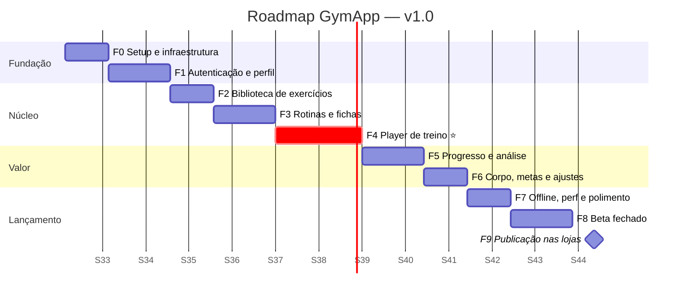

# 08 — Roadmap e Fases de Desenvolvimento

[← Voltar ao índice](./README.md)

> **Estimativa base:** 1 desenvolvedor full-time. ~13 semanas até a publicação nas lojas.
> As semanas são relativas ao início (não a datas fixas). Com 2 devs, as fases 2/3 e 5/6 podem correr em paralelo, cortando ~3 semanas.

---

## Linha do tempo



| Fase | Duração | Entregável | Testável por quem? |
|---|---|---|---|
| **0** — Fundação | 1 sem | Projeto rodando nos 2 SOs, banco criado | Dev |
| **1** — Auth e perfil | 1,5 sem | Cadastro, login, onboarding funcionando | Dev |
| **2** — Exercícios | 1 sem | Biblioteca navegável e buscável | Dev |
| **3** — Rotinas | 1,5 sem | Criar e editar rotinas e fichas | Dev + 1 usuário |
| **4** — Player ⭐ | 2 sem | **Treinar de verdade no app** | Dev + 3 usuários |
| **5** — Progresso | 1,5 sem | Histórico, gráficos e PRs | Beta interno |
| **6** — Corpo e metas | 1 sem | Medidas, metas, notificações, configurações | Beta interno |
| **7** — Polimento | 1 sem | Offline sólido, performance, acessibilidade | Beta interno |
| **8** — Beta | 1,5 sem | TestFlight + Internal Testing | 15–30 usuários |
| **9** — Publicação | 1 sem | App nas duas lojas | Público |

**Marco crítico:** ao final da **Fase 4** o app já é usável de verdade — dá para começar a testar com
usuários reais mesmo sem gráficos e configurações.

---

## FASE 0 — Fundação e Infraestrutura

**Objetivo:** projeto rodando nos dois sistemas operacionais, com banco criado e pipeline configurado.
**Duração:** 1 semana

### Entregáveis
- [ ] Projeto Expo criado com TypeScript e Expo Router
- [ ] Repositório Git inicializado com `.gitignore` correto
- [ ] Estrutura de pastas do [doc 01](./01-arquitetura-tecnica.md#3-estrutura-de-pastas) criada
- [ ] ESLint + Prettier + Husky + lint-staged + Commitlint
- [ ] NativeWind configurado com os tokens do [doc 07](./07-design-system-e-ux.md)
- [ ] `app.config.ts` com os 3 ambientes
- [ ] `.env.example` versionado e `.env` no gitignore
- [ ] Projetos Supabase `dev` e `staging` criados (o já existente vira produção)
- [ ] Supabase CLI linkado e rodando local (Docker)
- [ ] **Todas as migrations** do [doc 03](./03-migrations-e-sql.md) aplicadas
- [ ] **Todas as políticas RLS** do [doc 04](./04-seguranca-rls-e-auth.md) aplicadas
- [ ] Buckets de Storage criados com políticas
- [ ] `seed.sql` populando grupos musculares, equipamentos e 20 exercícios
- [ ] `database.types.ts` gerado
- [ ] Cliente Supabase configurado com SecureStore
- [ ] TanStack Query + persister configurados
- [ ] Development build rodando em **simulador iOS e emulador Android**
- [ ] EAS configurado (`eas.json` com dev/preview/production)
- [ ] Sentry instalado
- [ ] `docs/` versionado

### Critérios de saída
✅ `npm run typecheck`, `npm run lint` e `supabase db reset` passam sem erro
✅ App abre nos dois SOs mostrando uma tela "Hello" estilizada com os tokens
✅ Consulta de teste ao Supabase retorna os grupos musculares do seed

### Riscos
| Risco | Mitigação |
|---|---|
| Ambiente iOS mal configurado (Xcode, CocoaPods) | Resolver **agora**, não na véspera do lançamento |
| Docker não roda no Mac | Alternativa: trabalhar direto no projeto `dev` remoto |

---

## FASE 1 — Autenticação e Perfil

**Objetivo:** usuário cria conta, entra e completa o onboarding.
**Duração:** 1,5 semanas · **Épicos:** 1 e 2

### Entregáveis
- [ ] `AuthProvider` com `onAuthStateChange` e guards de rota
- [ ] 7 telas do grupo AUTH ([doc 05](./05-mapa-de-telas.md#-grupo-auth-7-telas))
- [ ] 4 telas de onboarding
- [ ] Validação com Zod + React Hook Form em todos os formulários
- [ ] Deep links configurados e testados (`gymapp://auth/*`)
- [ ] SMTP próprio configurado (Resend/SendGrid) com templates em PT-BR
- [ ] Rate limits do Auth configurados no Dashboard
- [ ] Tela de perfil com edição e upload de avatar
- [ ] Fluxo de excluir conta + Edge Function `delete-account`
- [ ] Tela de configurações com tema e unidades funcionando
- [ ] Componentes `Button`, `Input`, `Card`, `Screen`, `Toast`, `EmptyState`

### Critérios de saída
✅ Cadastro → e-mail de confirmação → onboarding → dashboard, sem travar
✅ Fechar e reabrir o app mantém a sessão
✅ Recuperação de senha funciona de ponta a ponta pelo deep link
✅ Excluir conta remove tudo (verificado no banco)
✅ Teste com 2 contas: nenhuma vê dado da outra

---

## FASE 2 — Biblioteca de Exercícios

**Objetivo:** o usuário encontra qualquer exercício rápido.
**Duração:** 1 semana · **Épico:** 3

### Entregáveis
- [ ] Tela de biblioteca com FlashList e seções por grupo muscular
- [ ] Busca full-text com debounce (usando `search_vector`)
- [ ] Filtros por grupo muscular, equipamento e favoritos
- [ ] Tela de detalhe do exercício
- [ ] Criar / editar / excluir exercício personalizado
- [ ] Favoritar com atualização otimista
- [ ] Modal seletor de exercícios (com seleção múltipla) — reusado na Fase 3
- [x] ~~Catálogo de exercícios~~ — **já pronto**: 138 exercícios em `supabase/seed/02_exercises.sql`
- [ ] Componente `ExerciseThumb` com fallback colorido por grupo muscular (v1 lança sem GIF — [D3](./11-decisoes-e-pendencias.md#d3--mídia-dos-exercícios))

### Critérios de saída
✅ Busca por "supino" retorna resultados em < 300ms
✅ Lista rola a 60fps com 150 itens
✅ Filtros combinados funcionam
✅ Exercício personalizado só aparece para quem criou

### ⚠️ Atenção
A produção/licenciamento das 150 mídias é a tarefa de maior risco de prazo desta fase.
Se não estiver resolvida, **desacoplar**: lançar com placeholder e adicionar as mídias depois via OTA.

---

## FASE 3 — Rotinas e Fichas

**Objetivo:** o usuário monta o programa de treino dele.
**Duração:** 1,5 semanas · **Épico:** 4

### Entregáveis
- [ ] Tab "Treinos" com rotinas do usuário e acesso aos templates
- [ ] Criar / editar / duplicar / arquivar rotina
- [ ] CRUD de fichas com reordenação por arrastar
- [ ] Editor de ficha: adicionar exercícios, definir metas, reordenar, remover
- [ ] Agrupamento em bi-set / tri-set
- [ ] Galeria de templates com pré-visualização e `copy_plan_template()`
- [ ] Definir rotina ativa
- [ ] Estimativa automática de duração da ficha
- [x] ~~Seed dos 5 templates do sistema~~ — **já pronto** em `supabase/seed/03_templates.sql`

### Critérios de saída
✅ Criar uma rotina ABC completa em menos de 5 minutos
✅ Reordenar exercícios persiste corretamente
✅ Copiar template gera cópia independente e editável
✅ Excluir rotina não apaga histórico de sessões

---

## FASE 4 — Player de Treino ⭐ (fase crítica)

**Objetivo:** treinar de verdade dentro do app.
**Duração:** 2 semanas · **Épico:** 5

> **É a fase mais importante do projeto.** Não reduzir o prazo dela. Se algo tiver que atrasar,
> que sejam as fases 5–6.

### Entregáveis
- [ ] `start_workout_session()` integrada — sessão nasce com as séries pré-preenchidas
- [ ] Tela do player conforme o [wireframe](./05-mapa-de-telas.md#️-player-de-treino--a-tela-mais-importante)
- [ ] Componente `SetRow` com edição inline de kg e reps
- [ ] Marcar série em 1 toque, com haptic e atualização otimista
- [ ] Última performance exibida por exercício (`v_exercise_last_performance`)
- [ ] Timer de descanso: auto-início, +15s/−15s/pular, roda em segundo plano
- [ ] Notificação local + som + vibração ao fim do descanso
- [ ] Cronômetro geral com pausa
- [ ] Adicionar/remover série e exercício durante o treino
- [ ] Tipos de série (aquecimento, drop, falha…) e suporte a unilateral
- [ ] Campos adaptados ao `tracking_type`
- [ ] Estado da sessão persistido em MMKV (sobrevive a fechar o app)
- [ ] Retomar sessão ativa ao reabrir
- [ ] Cancelar e finalizar com confirmação
- [ ] `finish_workout_session()` integrada
- [ ] Tela de resumo pós-treino com PRs e animação de celebração
- [ ] `expo-keep-awake` durante o treino

### Critérios de saída
✅ Um treino completo de 6 exercícios × 4 séries é registrado sem travamento
✅ Marcar série responde em < 100ms
✅ Timer dispara notificação com o app fechado
✅ Matar o app no meio do treino e reabrir retoma tudo
✅ PRs aparecem corretamente no resumo
✅ **Teste real:** desenvolvedor treina com o app por 1 semana inteira

---

## FASE 5 — Progresso e Análise

**Objetivo:** o usuário vê que está evoluindo — é o que traz ele de volta.
**Duração:** 1,5 semanas · **Épico:** 6

### Entregáveis
- [ ] Dashboard completo (`get_dashboard_summary()`)
- [ ] Histórico paginado com scroll infinito
- [ ] Calendário mensal de treinos
- [ ] Detalhe e exclusão de sessão passada
- [ ] Gráfico de volume semanal
- [ ] Distribuição de volume por grupo muscular
- [ ] Heatmap de frequência
- [ ] Gráfico de evolução por exercício (`get_exercise_history()`)
- [ ] Lista de recordes pessoais
- [ ] Cálculo e exibição de streak
- [ ] Estados vazios de todos os gráficos

### Critérios de saída
✅ Gráficos renderizam em < 500ms com 6 meses de dados
✅ Dashboard carrega em 1 chamada só ao banco
✅ Estados vazios aparecem quando não há dado suficiente

---

## FASE 6 — Corpo, Metas, Notificações e Configurações

**Objetivo:** fechar as funcionalidades da v1.
**Duração:** 1 semana · **Épicos:** 7, 8, 9, 10

### Entregáveis
- [ ] Registro e histórico de medidas corporais
- [ ] Gráfico de peso corporal
- [ ] Fotos de progresso com Storage privado, signed URLs e comparador
- [ ] CRUD de metas com progresso automático
- [ ] Lembretes de treino (notificação local agendada)
- [ ] Tela de configurações de notificações
- [ ] Conversão métrico/imperial em toda a UI
- [ ] Exportar dados em JSON
- [ ] Tela "Sobre" com versão e link para avaliar
- [ ] i18n estruturado (todas as strings extraídas para `pt-BR.json`)

### Critérios de saída
✅ Trocar para imperial converte toda a UI corretamente
✅ Lembrete dispara no horário certo, no fuso do usuário
✅ Fotos de progresso não são acessíveis sem autenticação (testar URL direta)
✅ Nenhuma string hardcoded na UI

---

## FASE 7 — Offline, Performance e Polimento

**Objetivo:** deixar sólido para colocar na mão de usuários reais.
**Duração:** 1 semana · **Épico:** 11

### Entregáveis
- [ ] Outbox com `client_id` e sincronização automática
- [ ] Indicador de status offline/sincronizando
- [ ] Teste em modo avião durante um treino completo
- [ ] Persistência do cache do TanStack Query
- [ ] Error boundary global
- [ ] Todos os estados de loading/empty/error revisados tela a tela
- [ ] Auditoria de acessibilidade (contraste, labels, alvos de toque, fonte 200%)
- [ ] Teste com VoiceOver e TalkBack nos fluxos críticos
- [ ] Otimização de imagens e bundle
- [ ] Cold start medido e otimizado (meta ≤ 2,5s)
- [ ] Advisors do Supabase (Security + Performance) sem alerta crítico
- [ ] Revisão de todos os textos e mensagens de erro
- [ ] Ícone, splash e assets finais aplicados

### Critérios de saída
✅ Treino completo em modo avião sincroniza sem duplicar nada ao voltar a rede
✅ Cold start ≤ 2,5s em aparelho intermediário (não só no simulador)
✅ Nenhuma mensagem de erro técnica visível ao usuário
✅ Checklist de segurança do [doc 04](./04-seguranca-rls-e-auth.md#8-checklist-de-segurança-antes-do-lançamento) 100% marcado

---

## FASE 8 — Beta Fechado

**Objetivo:** validar com usuários reais e corrigir o que aparecer.
**Duração:** 1,5 semanas

### Entregáveis
- [ ] Conta Apple Developer ativa (US$ 99/ano) e Google Play Console (US$ 25 único)
- [ ] Build de produção via EAS para as duas plataformas
- [ ] **TestFlight** com beta externo configurado
- [ ] **Google Play Internal Testing** configurado
- [ ] 15–30 testadores recrutados (frequentadores de academia reais)
- [ ] Canal de feedback (formulário ou grupo de WhatsApp)
- [ ] Sentry monitorado diariamente
- [ ] ≥ 2 ciclos de correção com base no feedback
- [ ] Política de Privacidade e Termos publicados em URL estável

### Critérios de saída
✅ Crash-free sessions ≥ 99%
✅ Nenhum bug P0/P1 aberto
✅ ≥ 10 testadores registraram pelo menos 3 treinos
✅ Feedback qualitativo majoritariamente positivo sobre o player

> ⚠️ **Google Play:** contas de desenvolvedor **pessoais** criadas após nov/2023 precisam de
> **12 testadores por 14 dias consecutivos** em teste fechado antes de liberar produção.
> Isso não é opcional e precisa começar cedo — planejar já na Fase 7. Contas de **organização**
> não têm essa exigência. Confirmar o requisito atual no Play Console antes de começar.

---

## FASE 9 — Publicação

**Objetivo:** app disponível nas duas lojas.
**Duração:** 1 semana (+ tempo de revisão das lojas)

Detalhes completos em [`09-publicacao-nas-lojas.md`](./09-publicacao-nas-lojas.md).

### Entregáveis
- [ ] Fichas das lojas preenchidas (nome, descrição, palavras-chave, categoria)
- [ ] Screenshots nos tamanhos exigidos por cada loja
- [ ] Ícone final em todos os tamanhos
- [ ] App Privacy (Apple) e Data Safety (Google) preenchidos
- [ ] Classificação etária respondida
- [ ] Build de produção enviado via `eas submit`
- [ ] Notas para o revisor (com conta de teste!)
- [ ] Aprovação nas duas lojas
- [ ] Monitoramento pós-lançamento nas primeiras 72h

### Critérios de saída
✅ App aprovado e disponível na App Store e no Google Play
✅ Instalação a partir da loja funciona em aparelho limpo
✅ Sem pico de crash nas primeiras 72h

---

## Backlog pós-lançamento (v1.1 e v2)

| Versão | Itens |
|---|---|
| **v1.1** (correções) | Bugs do lançamento, ajustes de UX apontados pelas avaliações, mais exercícios no catálogo |
| **v1.2** | Login social (Google + Apple), widget de próximo treino, Apple Watch básico |
| **v2.0 — Módulo Professor** | Papel de coach, vínculo professor↔aluno, prescrever ficha para aluno, acompanhar evolução do aluno, chat |
| **v2.x** | Assinatura premium (RevenueCat), integração Health/Fit, feed social, exportar PDF do treino |

---

## Como acompanhar o progresso

```
Fase 0  ⬜⬜⬜⬜⬜⬜⬜⬜⬜⬜   0%
Fase 1  ⬜⬜⬜⬜⬜⬜⬜⬜⬜⬜   0%
...
```

Sugestão: manter um `docs/PROGRESS.md` atualizado ao fim de cada fase, com o que foi entregue,
o que ficou pendente e as decisões tomadas no caminho.

### Definition of Done (vale para toda tarefa)
1. Funciona no **iOS e no Android**
2. Tem os 4 estados tratados (loading, empty, error, success)
3. Passa `lint` e `typecheck`
4. Funciona nos temas claro e escuro
5. Tem `accessibilityLabel` nos controles
6. Textos em PT-BR, sem string hardcoded fora do arquivo de i18n
7. Sem `console.log` esquecido
8. Testado em aparelho físico (não só simulador)

---

[← Design System](./07-design-system-e-ux.md) · [Índice](./README.md) · [Próximo: Publicação →](./09-publicacao-nas-lojas.md)
