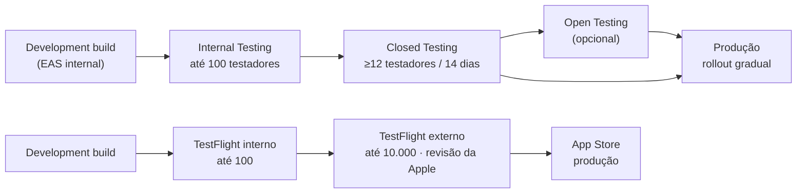

# 09 — Publicação nas Lojas

[← Voltar ao índice](./README.md)

> ⚠️ **As regras das lojas mudam com frequência.** Este documento traz o processo e os pontos de
> atenção; **sempre confirmar os requisitos vigentes** no App Store Connect e no Google Play Console
> no momento do envio (especialmente tamanhos de screenshot e `targetSdkVersion`).

---

## 1. Contas e custos

| Item | Custo | Prazo de aprovação | Observação |
|---|---|---|---|
| **Apple Developer Program** | US$ 99/ano | 24–48h (pode levar dias) | Pessoa física ou jurídica. PJ exige D-U-N-S Number (leva ~2 semanas) |
| **Google Play Console** | US$ 25 (pagamento único) | Poucas horas a 2 dias | Verificação de identidade obrigatória |
| **Expo EAS** | Free tier serve para começar | — | Plano pago acelera a fila de build |
| Domínio + hospedagem (política de privacidade) | ~R$ 40/ano | — | Pode ser uma página estática no GitHub Pages |

> 🕐 **Abrir as contas na Fase 6, não na Fase 9.** A verificação da Apple e do Google já travou muito
> lançamento por ser deixada para o fim. Se for publicar como **empresa**, o D-U-N-S Number precisa
> ser solicitado com ~1 mês de antecedência.

---

## 2. Configuração do EAS

### `eas.json`

```json
{
  "cli": { "version": ">= 12.0.0", "appVersionSource": "remote" },
  "build": {
    "development": {
      "developmentClient": true,
      "distribution": "internal",
      "env": { "EXPO_PUBLIC_APP_ENV": "development" },
      "ios": { "simulator": true },
      "android": { "buildType": "apk" }
    },
    "preview": {
      "distribution": "internal",
      "env": { "EXPO_PUBLIC_APP_ENV": "preview" },
      "android": { "buildType": "apk" },
      "channel": "preview"
    },
    "production": {
      "autoIncrement": true,
      "env": { "EXPO_PUBLIC_APP_ENV": "production" },
      "android": { "buildType": "app-bundle" },
      "channel": "production"
    }
  },
  "submit": {
    "production": {
      "ios": {
        "appleId": "seu@email.com",
        "ascAppId": "0000000000",
        "appleTeamId": "XXXXXXXXXX"
      },
      "android": {
        "serviceAccountKeyPath": "./credentials/play-service-account.json",
        "track": "internal"
      }
    }
  }
}
```

> 🔐 `play-service-account.json` **nunca** entra no Git. Guardar em EAS Secrets
> (`eas secret:create`) e adicionar `credentials/` ao `.gitignore`.

### Comandos

```bash
eas build --profile production --platform all
```

```bash
eas submit --profile production --platform ios
```

```bash
eas submit --profile production --platform android
```

### Versionamento

| Campo | Onde | Regra |
|---|---|---|
| `version` | `app.config.ts` | Semântico visível ao usuário: `1.0.0` |
| `buildNumber` (iOS) / `versionCode` (Android) | Remoto (EAS) | Incrementado automaticamente por build (`autoIncrement: true`) |

**Regra:** toda submissão precisa de um build number **maior** que o anterior. Deixar o EAS controlar
com `appVersionSource: "remote"` evita o erro mais comum de rejeição de upload.

### OTA Updates (EAS Update)

```bash
eas update --branch production --message "Corrige cálculo de volume"
```

| Pode ir por OTA ✅ | **Precisa** de novo build ❌ |
|---|---|
| Correção de bug em JS/TS | Nova biblioteca nativa |
| Ajuste de texto, cor, layout | Mudança em `app.config.ts` / permissões |
| Nova tela feita só com o que já existe | Novo ícone ou splash |
| Ajuste de query/lógica de negócio | Atualização de SDK do Expo |

> ⚠️ OTA **não pode** alterar funcionalidade de forma que contrarie o que foi aprovado na revisão.
> Corrigir bug e melhorar UX é permitido; mudar o propósito do app não é.

---

## 3. App Store (iOS)

### 3.1 Checklist técnico

- [ ] `bundleIdentifier` definitivo (não dá para mudar depois): `com.seudominio.gymapp`
- [ ] Ícone 1024×1024 PNG, **sem transparência e sem cantos arredondados**
- [ ] `NSCameraUsageDescription` e `NSPhotoLibraryUsageDescription` escritos em português e explicando o **porquê** real
- [ ] Suporte a todos os tamanhos de tela declarados
- [ ] Sem APIs privadas, sem código morto de teste
- [ ] Build assinado com certificado de distribuição (EAS gerencia)
- [ ] Testado em aparelho físico com iOS na versão mínima declarada (16.0)

### 3.2 Ficha da loja

| Campo | Limite | Conteúdo sugerido |
|---|---|---|
| Nome | 30 caracteres | `GymApp — Treino e Progresso` |
| Subtítulo | 30 caracteres | `Registre treinos e evolua` |
| Palavras-chave | 100 caracteres | `academia,treino,musculação,ficha,exercício,carga,hipertrofia,fitness,progresso` |
| Descrição | 4.000 caracteres | Benefício primeiro, funcionalidades depois |
| Novidades | 4.000 caracteres | `Primeira versão do GymApp!` |
| Categoria primária | — | **Health & Fitness** |
| Categoria secundária | — | Sports |
| URL de suporte | — | Obrigatório |
| URL da política de privacidade | — | **Obrigatório** |
| Classificação etária | — | 4+ (sem conteúdo restrito) |

### 3.3 Screenshots

Apple simplificou os tamanhos exigidos nos últimos anos — hoje, na prática, basta o conjunto do
**maior iPhone** (e o de iPad, se declarar suporte a tablet). **Confirmar no App Store Connect**
antes de gerar.

| Conjunto | Quantidade | Observação |
|---|---|---|
| iPhone (maior tamanho vigente) | 3 a 10 (recomendo 6) | Obrigatório |
| iPad 13" | 3 a 10 | **Só se** `supportsTablet: true` — como está `false`, não é necessário |

**Roteiro sugerido dos 6 screenshots:**

1. **Player de treino** — "Registre cada série em 1 toque"
2. **Dashboard** — "Veja sua evolução toda semana"
3. **Resumo com PR** — "Comemore cada recorde"
4. **Biblioteca de exercícios** — "138 exercícios com instruções de execução"
5. **Gráficos de progresso** — "Gráficos que mostram sua evolução"
6. **Editor de ficha** — "Monte sua rotina do seu jeito"

> Usar mockups com moldura de aparelho + legenda grande em cima. Ferramentas: Figma, Screenshots.pro
> ou Fastlane Snapshot.

### 3.4 Pontos de rejeição mais comuns — e como o plano já os cobre

| Guideline | Risco | Mitigação já prevista |
|---|---|---|
| **5.1.1(v)** — exclusão de conta | 🔴 Alto | Fluxo de excluir conta implementado na Fase 1 ([doc 04](./04-seguranca-rls-e-auth.md#5-edge-function-exclusão-de-conta)) |
| **5.1.1** — coleta de dados de saúde | 🟡 Médio | Política de Privacidade clara + App Privacy preenchido |
| **2.1** — app incompleto / crash | 🔴 Alto | Fase 8 (beta) + Sentry antes de submeter |
| **4.2** — funcionalidade mínima | 🟡 Médio | App tem funcionalidade real e substancial |
| **2.3.3** — screenshots não representam o app | 🟡 Médio | Screenshots gerados de telas reais, não de mockups fictícios |
| **1.4.1** — alegação médica | 🟡 Médio | Termos deixam explícito que o app **não** substitui profissional |
| **3.1.1** — pagamento externo | ⚪ N/A | v1 é gratuita, sem compras |
| **4.8** — Sign in with Apple | ⚪ N/A na v1 | Só e-mail/senha. **Se adicionar Google login na v1.2, Sign in with Apple vira obrigatório** |

### 3.5 Notas para o revisor (campo "App Review Information")

**Preencher sempre — a falta de conta de teste é uma das causas mais rápidas de rejeição.**

> ✅ **A conta já existe** no projeto Supabase (criada em 14/08/2026, e-mail confirmado, login
> validado pela API de auth). Falta apenas popular o histórico — fazer depois da Fase 4, quando
> o player permitir registrar treinos de verdade. **Não submeter antes disso:** revisor que entra
> numa conta vazia não consegue testar o fluxo principal descrito abaixo.

```
CONTA DE TESTE
E-mail: revisor@gymapp.com.br
Senha: Revisor2026!
(Conta já tem histórico de treinos e uma rotina configurada.)

COMO TESTAR O FLUXO PRINCIPAL
1. Entre com a conta acima.
2. Na aba Início, toque em "Iniciar treino".
3. Marque as séries tocando no checkbox à direita.
4. Toque em "Finalizar treino" para ver o resumo.

OBSERVAÇÕES
- O app coleta peso e medidas corporais informados pelo próprio usuário,
  usados apenas para exibir a evolução dele. Não há compartilhamento com terceiros.
- A exclusão de conta está em: Perfil > Configurações > Conta > Excluir conta.
- Não há compras no app nesta versão.
```

---

## 4. Google Play (Android)

### 4.1 Checklist técnico

- [ ] `package` definitivo: `com.seudominio.gymapp`
- [ ] Formato **AAB** (`buildType: "app-bundle"`) — APK não é aceito em produção
- [ ] `targetSdkVersion` no nível exigido pelo Play no momento do envio (a exigência sobe todo ano — **confirmar no Console**)
- [ ] Permissões declaradas e justificadas: `CAMERA`, `READ_MEDIA_IMAGES`, `POST_NOTIFICATIONS`, `VIBRATE`
- [ ] Ícone adaptativo com conteúdo dentro da área segura central
- [ ] Assinatura via **Play App Signing** (EAS configura)
- [ ] ProGuard/R8 habilitado
- [ ] Testado em Android na versão mínima declarada (8.0 / API 26)

### 4.2 Ficha da loja

| Campo | Limite | Conteúdo |
|---|---|---|
| Nome | 30 caracteres | `GymApp — Treino e Progresso` |
| Descrição curta | 80 caracteres | `Monte seu treino, registre cada série e acompanhe sua evolução.` |
| Descrição completa | 4.000 caracteres | Texto completo com funcionalidades |
| Categoria | — | **Saúde e fitness** |
| Tags | até 5 | Fitness, Treino, Musculação |
| E-mail de contato | — | Obrigatório |
| Política de privacidade | — | **Obrigatório** |

### 4.3 Assets gráficos

| Asset | Tamanho | Obrigatório |
|---|---|---|
| Ícone | 512×512 PNG 32-bit | ✅ |
| Feature graphic | 1024×500 PNG/JPG | ✅ |
| Screenshots de celular | mín. 2, máx. 8 · lado maior 1920px | ✅ |
| Screenshots de tablet 7" e 10" | mín. 2 cada | Só se declarar suporte a tablet |
| Vídeo promocional (YouTube) | — | Opcional (aumenta conversão) |

### 4.4 Formulários obrigatórios

| Formulário | Pontos de atenção |
|---|---|
| **Data safety** | Declarar: e-mail, ID de usuário, **dados de saúde e fitness**, fotos. Marcar: dados criptografados em trânsito ✅ · usuário pode solicitar exclusão ✅ · sem compartilhamento com terceiros ✅ |
| **Classificação de conteúdo** | Questionário IARC → resultado esperado: Livre / 3+ |
| **Público-alvo** | Marcar **13+**. ⚠️ Marcar "inclui crianças" ativa as regras da Families Policy — evitar |
| **Anúncios** | Declarar "não contém anúncios" |
| **Declaração de saúde** | Play pode pedir esclarecimento por ser app de fitness — responder que os dados são autoinformados e usados só no próprio app |

### 4.5 ⚠️ Teste fechado obrigatório (contas pessoais)

Contas de desenvolvedor **pessoais** criadas a partir de nov/2023 precisam rodar um **teste fechado
com um número mínimo de testadores por um período contínuo** antes de poder solicitar acesso à
produção (à época da escrita: **12 testadores por 14 dias consecutivos**).

**Impacto no cronograma:** isso precisa começar **na Fase 7/8**, não na 9 — senão trava o lançamento
por duas semanas. Contas de **organização** não têm essa exigência.

> ✅ **Confirmar a regra vigente no Play Console** antes de montar o cronograma final.

---

## 5. Trilhas de lançamento



**Rollout gradual no Google Play:** publicar com 10% → 25% → 50% → 100%, acompanhando crash rate a
cada etapa. A Apple oferece "Phased Release" (7 dias) — **manter ativado**.

---

## 6. Prazos de revisão

| Loja | Prazo típico | Se for rejeitado |
|---|---|---|
| App Store | 24–48h (pode chegar a 1 semana) | Corrigir e reenviar; usar o Resolution Center para responder |
| TestFlight externo | 24–48h na primeira submissão | Builds seguintes geralmente passam direto |
| Google Play (1ª publicação) | Até 7 dias | Costuma ser mais rápido nas atualizações |
| Google Play (atualizações) | Algumas horas a 2 dias | — |

> 📅 **Planejar 2 semanas de folga** entre "código pronto" e "app na loja". Rejeição na primeira
> submissão é comum e normal.

---

## 7. Texto da descrição (rascunho)

```
Transforme seu treino em progresso visível.

O GymApp é o companheiro de academia que registra cada série, cada carga
e cada recorde — para você saber exatamente o quanto está evoluindo.

🏋️ TREINO GUIADO
Siga sua ficha passo a passo. O app já mostra a carga que você usou da
última vez e pré-preenche tudo — você só confirma.

⏱️ TIMER DE DESCANSO AUTOMÁTICO
Marcou a série, o cronômetro começa. Com aviso mesmo em segundo plano.

📊 EVOLUÇÃO EM GRÁFICOS
Volume semanal, distribuição por grupo muscular, evolução de carga por
exercício e frequência de treinos.

🏆 RECORDES PESSOAIS
O app detecta sozinho quando você bate um recorde de carga, repetições
ou 1RM estimado.

📋 MONTE SUA ROTINA
Crie seu treino ABC do zero ou comece por um dos modelos prontos:
Full Body, ABC, Push Pull Legs, Upper Lower e ABCDE.

📚 138 EXERCÍCIOS
Biblioteca com instruções de execução passo a passo, músculos
trabalhados e equipamento. Dá para criar os seus também.

⚖️ MEDIDAS E FOTOS
Acompanhe peso, percentual de gordura, circunferências e fotos de
progresso — tudo privado, só você vê.

📵 FUNCIONA SEM INTERNET
Academia com sinal ruim não é problema. Treine offline e o app
sincroniza sozinho quando a conexão voltar.

Gratuito. Sem anúncios.

—
O GymApp é uma ferramenta de registro e acompanhamento. Ele não substitui
a orientação de um profissional de educação física ou de saúde.
```

---

## 8. Checklist final de submissão

### Antes de gerar o build de produção
- [ ] `version` atualizado no `app.config.ts`
- [ ] Apontando para o Supabase de **produção**
- [ ] Sentry com o DSN de produção e `environment: 'production'`
- [ ] Sem `console.log` e sem código de debug
- [ ] Ícone e splash finais
- [ ] Teste completo em aparelho físico iOS **e** Android
- [ ] Excluir conta testado no build de produção

### Antes de enviar para revisão
- [ ] Screenshots gerados a partir de telas reais
- [ ] Descrições revisadas (sem erro de português)
- [ ] Política de Privacidade e Termos no ar e acessíveis
- [ ] App Privacy (Apple) preenchido
- [ ] Data Safety (Google) preenchido
- [ ] Classificação etária respondida
- [ ] **Conta de teste criada, com dados, e informada nas notas do revisor**
- [ ] Notas para o revisor escritas
- [ ] Phased Release / rollout gradual ativado

### Depois de publicar
- [ ] Instalar a partir da loja em aparelho limpo e testar cadastro do zero
- [ ] Monitorar Sentry a cada poucas horas nas primeiras 72h
- [ ] Acompanhar avaliações e responder
- [ ] Verificar métricas de instalação e retenção
- [ ] Ter um plano de hotfix por OTA pronto

---

[← Roadmap](./08-roadmap-e-fases.md) · [Índice](./README.md) · [Próximo: Qualidade e CI/CD →](./10-qualidade-testes-e-cicd.md)
